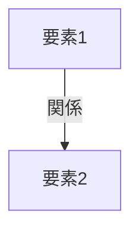

# 📄 YouTube解析スクラップ: [動画タイトル]

🗞️ **[Scrap] [人間向けの要約タイトル]**
- **元ソース**: [YouTube動画 / 記事](URL)
- **チャンネル**: [チャンネル名 / 発信者名](URL)
- **投稿日**: [YYYY-MM-DD]
- **視聴回数**: [数値]
- **解析日**: [解析日 YYYY-MM-DD]
- **タグ**: #タグ1 #タグ2

## 概要
[ここに3行程度の概要を記述]

## 詳細トピック
- [トピック1]
- [トピック2]
- [トピック3]

## 🕸️ 勢力・相関図 (ネットワークマップ)


## 📊 マッピング用メタデータ (Mapping Metadata)
※このセクションのJSON構造（キー名）はシステムが読み取るため変更しないでください。

```json
{
  "source": {
    "platform": "YouTube",
    "channel": "[チャンネル名]",
    "url": "[URL]",
    "source_bias": {
      "anti_ds": 0.0,
      "establishment": 0.0,
      "tone_optimism": 0.0
    }
  },
  "entities": [
    {"name": "[個人・組織名]", "stance": "[立場/状況]", "sentiment": 0.0}
  ]
}
```
