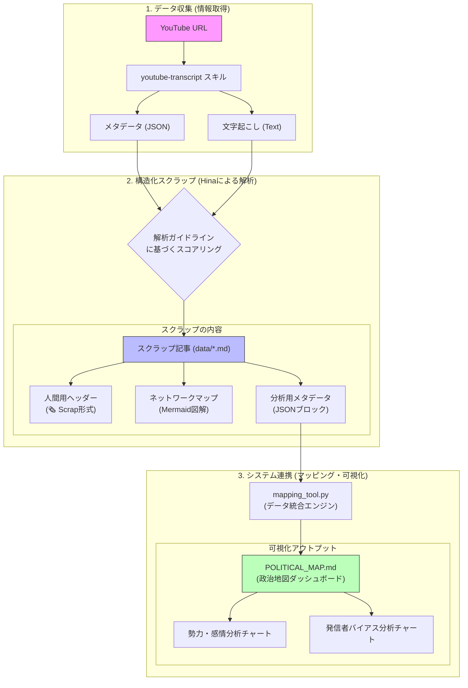

# 📋 解析ワークフロースキーム (全体像)

現在のプロジェクトにおける、動画取得からマッピングまでの情報の流れを整理したスキーム図です。

## 🚀 各ステップの役割

1.  **Data Ingestion**: 原材料の収集。YouTubeのメタデータと文字起こしを自動で抜き出します。
2.  **Structured Scraping**: ぬいさんと相談して決めた「標準フォーマット」への整形。ここでAIが感情値やバイアス値をスコアリングします。
3.  **System Integration**: 独立したスクラップ記事を統合。Pythonスクリプトが全ファイルを読み込み、平均値を算出して全体の「地図」を自動更新します。
