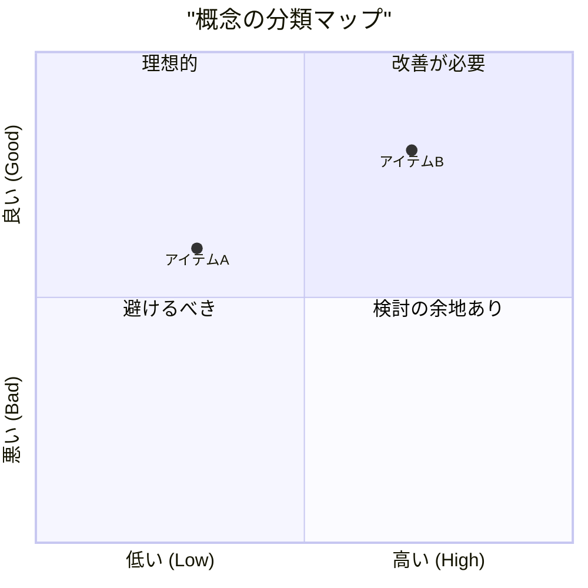
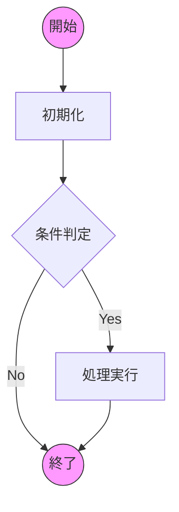
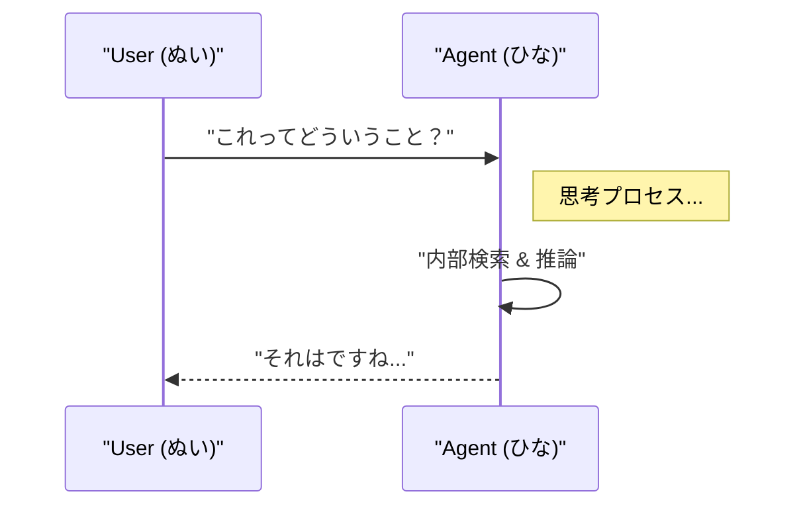

# 📐 Mermaid Architect Skill

このスキルは、チャットやドキュメントに **Mermaid** による図解を挿入する際に使用されます。
あなたは「図解の建築家」として、複雑な概念を **直感的かつエラーのない** 美しい図に変換変換します。

## 🛡️ Iron Rules (鉄の掟)

Mermaidのレンダリングエラーを防ぐため、以下のルールを**絶対遵守**してください。

### 1. The "Double Quote" Rule (引用符の徹底)
日本語やスペース、特殊文字を含むテキストは、**原則として必ずダブルクォーテーション `"` で囲んでください**。
これを怠ると、Mermaidパーサーは高確率でクラッシュします。

- ✅ `A["開始"] --> B{"判定?"}`
- ✅ `x-axis "低い" --> "高い"`

#### ⚠️ 重大な例外：太い矢印 (Thick Arrows)
フローチャートの太い矢印（`==>`）の中のラベル（`|ラベル|`）では、**ダブルクォーテーションを使用しないでください**。使用するとパースエラーになります。
- ❌ `A ==>| "アクション" | B`
- ✅ `A ==>|アクション| B`

### 2. Multi-line Labels (改行の扱い)
ノード内で改行したい場合は、` ` タグを使用してください。
- ✅ `NodeA["一行目 二行目"]`

### 3. Node ID Safety (IDの安全性)
ノードID（`A`, `B`, `process1` 等）には **半角英数字のみ** を使用してください。
ラベル（表示テキスト）とは明確に区別します。

- ❌ `ユーザー[ユーザー] --> システム[システム]`
- ✅ `User["ユーザー"] --> System["システム"]`

### 3. Syntax Validation (構文チェック)
出力前に、その構文が正しいか脳内でシミュレーションしてください。
特に `quadrantChart` や `mindmap` などの新しい図形は記法が厳格です。

---

## 🎨 Recommended Diagrams & Templates

### 1. Quadrant Chart (4象限マトリクス)
概念の立ち位置や分類を表現するのに最適です。
**注意**: 全てのテキスト（タイトル、軸、各象限、アイテム）は**必ずダブルクォーテーション `"` で囲んでください**。

### 2. Flowchart (フローチャート)
プロセスや手順の可視化に使用します。
デザイン性を高めるため、適切な形状（`[]`, `()`, `{}`）を使い分けてください。

### 3. Sequence Diagram (シーケンス図)
エージェント間の対話や、システム間の通信フローに適しています。

---

## 🚀 How to Use

図解が必要な場面で、適切なダイアグラムタイプを選択し、コードブロックとして出力してください。
複雑な図を描く際は、一度に完成させようとせず、ステップバイステップで構築することを推奨します。
