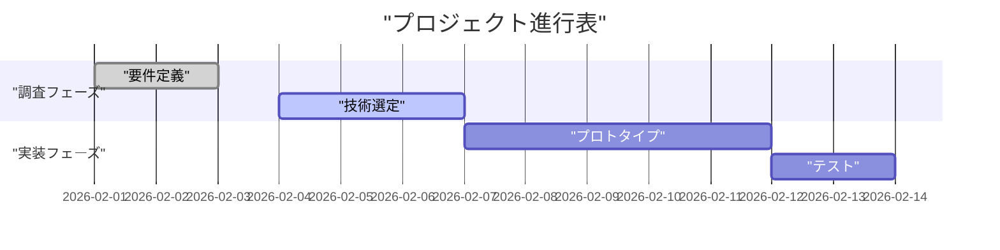
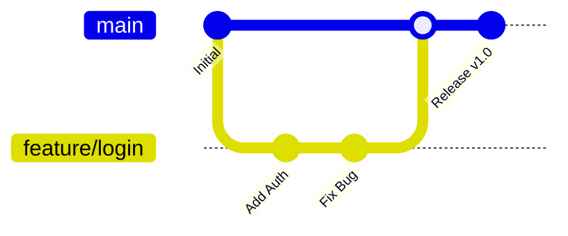
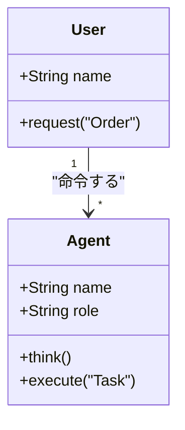
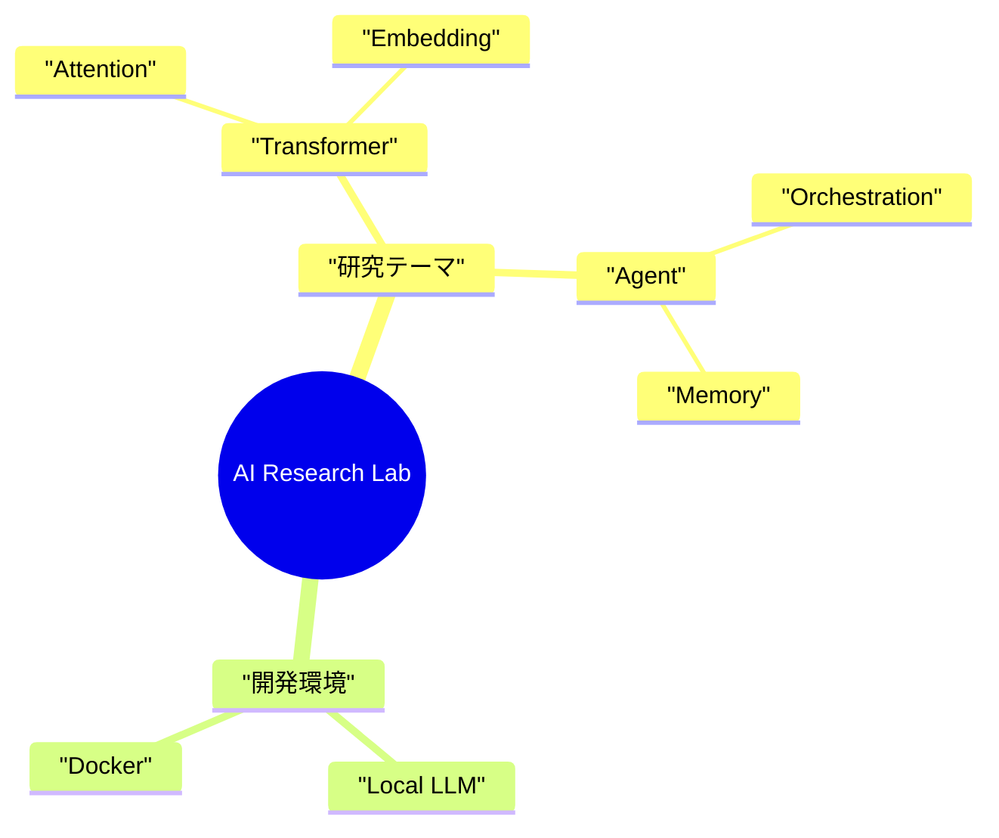
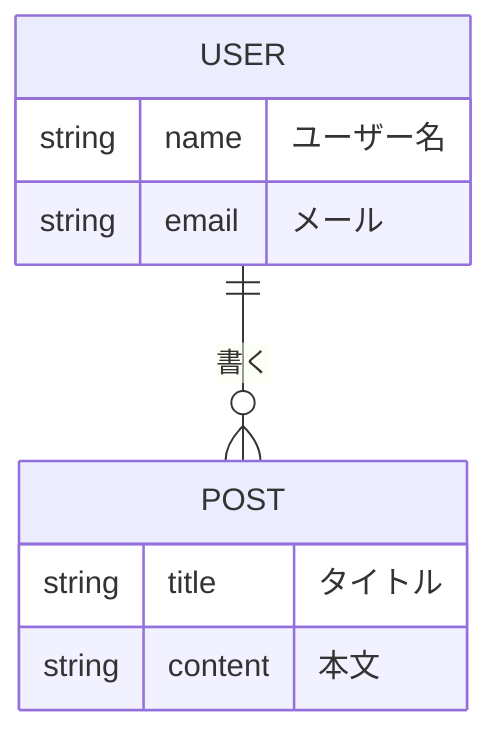
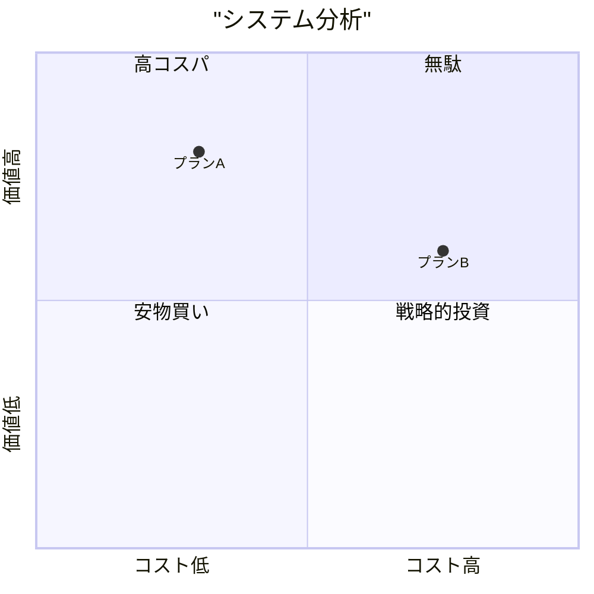

# 📐 Mermaid Templates & Snippets

コピー＆ペーストして使える実用的な図解テンプレート集です。
**全ての日本語テキストは必ず `"` で囲んでください。**

## 1. Gantt Chart (プロジェクト進行)
タスクのスケジュール管理に使用します。

## 2. Git Graph (ブランチ戦略)
Gitのコミット履歴やブランチ運用を可視化します。
ラベル（コミットメッセージ等）は引用符で囲むのが安全です。

## 3. Class Diagram (クラス設計)
オブジェクト指向設計の可視化に使用します。
型やメソッド名に日本語を使う場合は特に注意してください。

## 4. Mindmap (マインドマップ)
アイデアの発散や構造化に使用します。
**注意**: `mindmap` は構文が独特で、スペースやインデントに敏感です。

## 5. ER Diagram (データベース設計)
エンティティ間の関係を定義します。

## 6. Quadrant Chart (4象限マトリクス)
**必須: 全ての文字列を `"` で囲むこと**
引用符で囲めば、日本語も問題なく表示されます。

