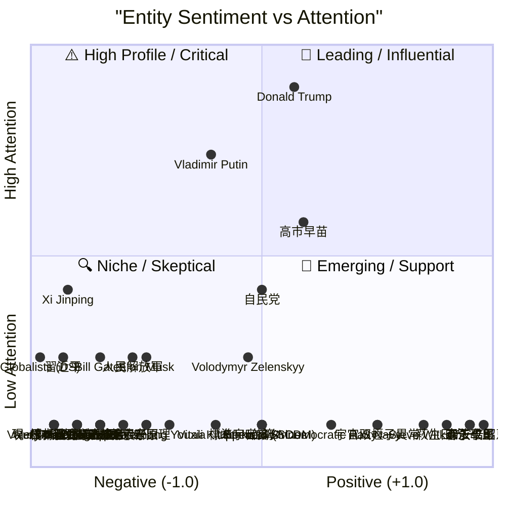
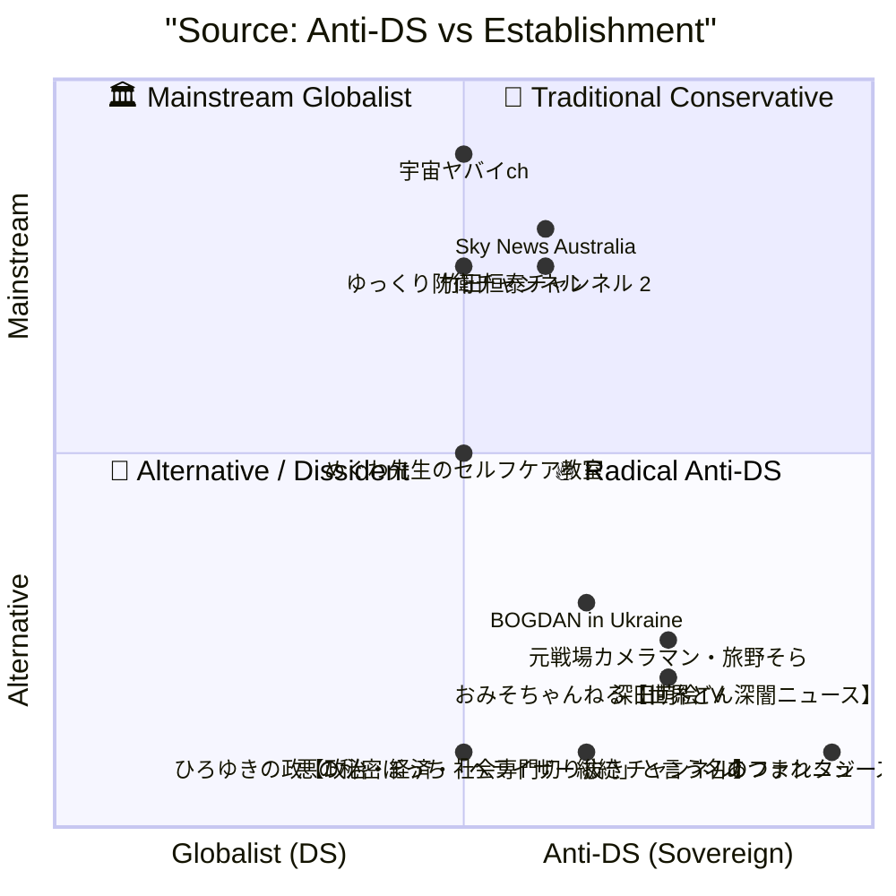

# 🗺️ Political Entity & Source Map (Aggregated)
Generated on: 2026/02/06 01:32

## 👥 1. Entity Analysis (勢力図)
| Entity | Avg. Sentiment | Mentions | Primary Stance(s) | Sources |
| :--- | :---: | :---: | :--- | :--- |
| **習近平** | 🔴 -0.85 | 2 | Absolute Dictator, Ruthless Consolidator | 深田萌絵TV, 竹田恒泰チャンネル 2 |
| **人民解放軍** | 🔴 -0.55 | 2 | Tool of Dictator (Purged), Weakened Institution | 深田萌絵TV, 竹田恒泰チャンネル 2 |
| **台湾** | ⚪ 0.00 | 1 | Target of Invasion | 竹田恒泰チャンネル 2 |
| **Donald Trump** | ⚪ 0.13 | 6 | Scandal Target, Defender/Target, Peace Broker / Mastermind, Defender, Disrupter of Old Order, Aggressive/Pragmatic | あつまれニュースの森, BOGDAN in Ukraine, おみそちゃんねる【世界どん深闇ニュース】, Sky News Australia |
| **Elon Musk** | 🔴 -0.50 | 2 | Involved/Denying, Questionable Respondent | BOGDAN in Ukraine |
| **Bill Gates** | 🔴 -0.70 | 2 | Involved/Denying, Exposed Associate | BOGDAN in Ukraine |
| **Democratic Party** | ⚪ 0.30 | 1 | Accuser | BOGDAN in Ukraine |
| **Vladimir Putin** | ⚪ -0.22 | 5 | Tough Negotiator, Watcher, Aggressor (Infraterrorism), Weakened Authority, Strategic Partner | あつまれニュースの森, BOGDAN in Ukraine, ゆっくり防衛チャンネル, Sky News Australia |
| **Xi Jinping** | 🔴 -0.83 | 3 | Insecure Purger, Target of Containment, Paranoid/Authoritarian | あつまれニュースの森, ゆっくり防衛チャンネル, 深田萌絵TV |
| **Globalists (DS)** | 🔴 -1.00 | 2 | Old System Holders, Systemic Corruptors | あつまれニュースの森, BOGDAN in Ukraine |
| **Volodymyr Zelenskyy** | ⚪ -0.05 | 2 | Critical Participant, Defender (Internal Issues) | BOGDAN in Ukraine, Sky News Australia |
| **Vitali Klitschko** | ⚪ -0.20 | 1 | Kyiv Mayor (Conflicts w/ Gov) | BOGDAN in Ukraine |
| **Zhang Youxia** | 🔴 -0.40 | 1 | Fallen Inner Circle | 深田萌絵TV |
| **高市早苗** | ⚪ 0.17 | 4 | Defender, Target | ひろゆきの政【政治・経済・社会専門切り抜きチャンネル】, 悪の秘密ぼっち「ヘライザー総統」と言う名のファンタジー, おみそちゃんねる【世界どん深闇ニュース】 |
| **野田佳彦** | 🔴 -0.70 | 1 | Target | 悪の秘密ぼっち「ヘライザー総統」と言う名のファンタジー |
| **鈴木貴子** | 🔴 -0.60 | 1 | Defender | 悪の秘密ぼっち「ヘライザー総統」と言う名のファンタジー |
| **森永卓郎** | 🟢 0.90 | 1 | Accuser | 悪の秘密ぼっち「ヘライザー総統」と言う名のファンタジー |
| **財務省** | 🔴 -0.90 | 1 | Target | 悪の秘密ぼっち「ヘライザー総統」と言う名のファンタジー |
| **統一教会** | 🔴 -0.90 | 1 | Involved | ひろゆきの政【政治・経済・社会専門切り抜きチャンネル】 |
| **自民党** | ⚪ 0.00 | 3 | Tool, Target | ひろゆきの政【政治・経済・社会専門切り抜きチャンネル】, おみそちゃんねる【世界どん深闇ニュース】 |
| **トヨタ** | ⚪ 0.00 | 1 | Involved | ひろゆきの政【政治・経済・社会専門切り抜きチャンネル】 |
| **日本国民** | 🔴 -0.90 | 1 | Target | ひろゆきの政【政治・経済・社会専門切り抜きチャンネル】 |
| **ホメイニ** | 🔴 -0.90 | 1 | Aggressor | 元戦場カメラマン・旅野そら |
| **パフラヴィー皇帝** | 🔴 -0.80 | 1 | Aggressor | 元戦場カメラマン・旅野そら |
| **イラン国民** | 🔴 -0.70 | 1 | Victim | 元戦場カメラマン・旅野そら |
| **米国** | 🔴 -0.50 | 1 | Involved | 元戦場カメラマン・旅野そら |
| **現イスラム体制** | 🔴 -0.90 | 1 | Domination | 元戦場カメラマン・旅野そら |
| **安倍昭恵** | 🟢 1.00 | 1 | Defender | おみそちゃんねる【世界どん深闇ニュース】 |
| **萩生田光一** | 🟢 0.80 | 1 | Defender | おみそちゃんねる【世界どん深闇ニュース】 |
| **ひろゆき** | 🔴 -0.70 | 1 | Skeptic | おみそちゃんねる【世界どん深闇ニュース】 |
| **Steve Witkoff** | 🟢 0.70 | 1 | Personal Negotiator | Sky News Australia |
| **標準宇宙論 (ΛCDM)** | ⚪ 0.00 | 1 | 主流派モデル (危機) | 宇宙ヤバイch |
| **宇宙原理** | 🔴 -0.50 | 1 | 否定されつつある前提 | 宇宙ヤバイch |
| **宇宙双極子異常** | 🟢 0.50 | 1 | 新発見の観測事実 | 宇宙ヤバイch |
| **週刊文春** | 🔴 -0.80 | 1 | Accuser | おみそちゃんねる【世界どん深闇ニュース】 |
| **安住淳** | 🔴 -0.70 | 1 | Target | おみそちゃんねる【世界どん深闇ニュース】 |
| **森下千里** | 🟢 0.90 | 1 | Defender | おみそちゃんねる【世界どん深闇ニュース】 |
| **憲法改正** | 🟢 0.90 | 1 | Defender | おみそちゃんねる【世界どん深闇ニュース】 |
| **Russian Duma Speaker** | 🔴 -0.80 | 1 | Aggressive Rhetoric | ゆっくり防衛チャンネル |
| **Valery Gerasimov** | 🔴 -0.90 | 1 | Corrupt/Incompetent | ゆっくり防衛チャンネル |
| **PLA Top Brass** | 🔴 -0.70 | 1 | Purged/Corrupt | ゆっくり防衛チャンネル |
| **Iran Regime** | 🔴 -0.80 | 1 | Anti-West/Vulnerable | BOGDAN in Ukraine |
| **US Navy** | 🟢 0.50 | 1 | Dominant | BOGDAN in Ukraine |
| **Upper Jaw Sinus** | ⚪ 0.00 | 1 | Target of Care | めぐわ先生のセルフケア教室 |
| **Ethmoid Sinus** | ⚪ 0.00 | 1 | Target of Care | めぐわ先生のセルフケア教室 |

### 🌀 Political Entity Landscape

## 🌐 2. Information Source Analysis (発信者マップ)
| Source Channel | Anti-DS | Establishment | Tone (Optimism) |
| :--- | :---: | :---: | :---: |
| **竹田恒泰チャンネル 2** | 0.20 | 0.50 | ☁️ -0.20 |
| **BOGDAN in Ukraine** | 0.30 | -0.40 | ⛈️ -0.50 |
| **あつまれニュースの森** | 0.90 | -0.80 | ☀️ 0.40 |
| **深田萌絵TV** | 0.50 | -0.60 | ⛈️ -0.50 |
| **悪の秘密ぼっち「ヘライザー総統」と言う名のファンタジー** | 0.30 | -0.80 | ⛈️ -0.50 |
| **ひろゆきの政【政治・経済・社会専門切り抜きチャンネル】** | 0.00 | -0.80 | ⛈️ -0.90 |
| **元戦場カメラマン・旅野そら** | 0.50 | -0.50 | ☁️ -0.20 |
| **おみそちゃんねる【世界どん深闇ニュース】** | 0.50 | -0.60 | ☀️ 0.50 |
| **Sky News Australia** | 0.20 | 0.60 | ☀️ 0.50 |
| **宇宙ヤバイch** | 0.00 | 0.80 | ☁️ 0.20 |
| **ゆっくり防衛チャンネル** | 0.00 | 0.50 | ☁️ 0.10 |
| **めぐわ先生のセルフケア教室** | 0.00 | 0.00 | ☀️ 1.00 |

### 🌀 Source Bias Landscape
