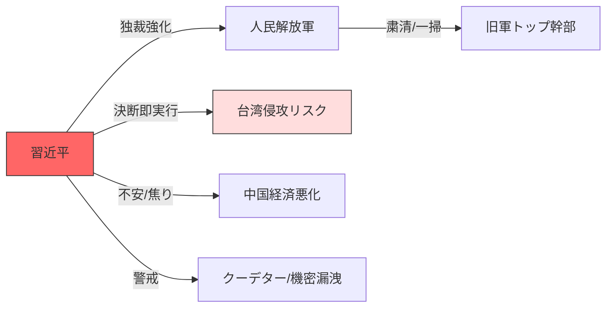

# 📄 YouTube Analysis Scrap: 中国軍トップ一掃：習近平独裁の加速と台湾侵攻リスク

🗞️ **[Scrap] 中国軍トップ一掃：習近平独裁の加速と台湾侵攻リスク**
- **Source**: [YouTube Video](https://www.youtube.com/watch?v=n854reSZ9SQ)
- **Channel**: 【公式】竹田恒泰チャンネル 2 (https://www.youtube.com/@takeda_ch)
- **Upload Date**: 2026-02-03
- **View Count**: 61,521
- **Date**: 2026-02-03
- **Tags**: #政治 #中国 #習近平 #台湾侵攻 #人民解放軍 #粛清 #竹田恒泰

## 概要
中国の習近平国家主席が、人民解放軍の最高指導機関「中央軍事委員会」のメンバーを実質的に一掃し、独裁体制を極限まで強化している異常事態を解説。軍の制服組トップである張又侠氏らの失脚により、軍内部で習氏に意見できる実力者が不在となり、習氏の決断がダイレクトに軍の行動に反映される「台湾侵攻の即時実行体制」が整いつつある。

## 詳細トピック
- **中央軍事委員会の「一掃」**: 2022年発足時の7人のメンバーが、今回の粛清により習近平氏と張又侠（※実際は張民氏らへの交代含む）らのわずか2人にまで激減する見通し。
- **台湾侵攻への影響**: 「ブレーキ役」がいなくなることで、習近平氏が「台湾統一」の決断を下した際、軍が即座に無批判に作動するリスクが高まった。
- **粛清の背景にある焦り**: 汚職対策を名目にしているが、実態はクーデター未遂への疑念や軍事機密（核兵器関連）のアメリカへの漏洩が原因との見方もある。

## 🕸️ 勢力・関連図 (Network Map)


---

## 📊 Mapping Metadata
```json
{
  "scraped_at": "2026-02-03",
  "project_tags": ["Political"],
  "source": {
    "platform": "YouTube",
    "channel": "竹田恒泰チャンネル 2",
    "url": "https://www.youtube.com/watch?v=n854reSZ9SQ",
    "source_bias": {
      "anti_ds": 0.2,
      "establishment": 0.5,
      "tone_optimism": -0.2
    }
  },
  "entities": [
    {"name": "習近平", "stance": "Absolute Dictator", "sentiment": -0.9},
    {"name": "人民解放軍", "stance": "Tool of Dictator (Purged)", "sentiment": -0.5},
    {"name": "台湾", "stance": "Target of Invasion", "sentiment": 0.0}
  ],
  "reliability_score": 0.8,
  "tags": ["China", "XiJinping", "MilitaryPurge", "TaiwanInvasion"]
}
```
