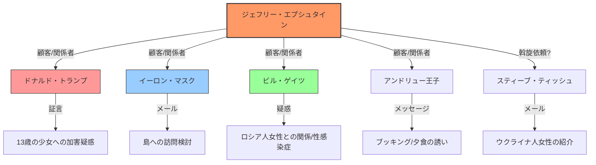

# 🗞️ [Scrap] エプシュタイン新文書公開と波及する疑惑

**Source**: [YouTube Video](https://www.youtube.com/watch?v=c4UeetTkfxU)
**Channel**: BOGDAN in Ukraine (https://www.youtube.com/@BOGDAN_Ukraine)
**Upload Date**: 2026-02-03
**View Count**: 8,924
**Date**: 2026-02-03
**Tags**: #政治 #エプシュタイン #米国 #トランプ #イーロンマスク #陰謀論 #ウクライナ #ロシア #BOGDAN

## 📝 概要 (Executive Summary)
エプシュタイン事件に関連する新文書が公開され、トランプ前大統領、イーロン・マスク、ビル・ゲイツ、アンドリュー王子らの名前が含まれていることが波紋を呼んでいる。
文書には具体的な性的虐待の描写や、著名人の島への訪問を示唆するメールなどが含まれており、特にトランプ氏に関しては3000回以上の言及があるとされる（※動画内の主張）。
これらが2026年（※動画内発言ママ、実際は2024年等の言い間違いの可能性あり）の大統領選や国際情勢に政治的に利用される可能性や、新たな陰謀論（ピザゲート再燃）への懸念も語られている。

## 🔍 詳細トピック (Key Topics)

### 1. 新文書の内容と衝撃
- 米司法省が公開した大量の文書（数百万ページ規模の一部）。
- トランプ氏の名前が多数登場し、マール・ア・ラーゴでの「非公式オークション」やゴルフ場に関する不穏な証言も含まれるとされる。
- しかし、司法省側は「証拠能力なし」「信頼性に乏しい」とし、裏付けのない証言アーカイブであるという立場を取っている。

### 2. 渦中の著名人たち



- **ドナルド・トランプ**: 過去の13-14歳の少女への加害証言（目撃証言）などが言及されているが、法的な裏付けは未確認。
- **イーロン・マスク**:  エプシュタインとのメールで「島への訪問」を示唆する内容（「島にヘリで来るのは何人？」「自分と妻になるかも」）が見つかったとされる。本人は訪問を公式に否定している。
- **ビル・ゲイツ**: ロシア人女性との関係や、性感染症に関する記述があるとされ、以前からの疑惑が再燃。
- **アンドリュー王子**:  「自由公爵」という名前でのメールやり取りがあり、島での滞在やマッサージに関する疑惑が指摘されている。
- **スティーブ・ティッシュ**: NYジャイアンツ共同オーナー。ウクライナ人女性の斡旋に関与した旨のメールが残っているとされる。

### 3. 政治的背景と陰謀論
- **選挙妨害説**: 文書公開はトランプの再選を阻止するための民主党側の戦略ではないかという見方。
- **めくらまし戦略**: トランプ側がスキャンダルから目を逸らせるために、イラン、キューバ、グリーンランドなどへの強硬な外交・軍事行動（「外交カード」）を切る可能性があると指摘。
- **Threadsの検索規制**: Meta社のSNS「Threads」で「Pizza」という単語が検索できなくなっている現象を紹介。これがエプシュタイン文書内の隠語（Pizza=少女, Grape Soda=強姦等の隠語説）と関連しているのではないかという「ピザゲート」理論が再浮上している。

## 💡 考察 (Video Analysis)
動画配信者は、これらの情報が単なるゴシップではなく「正式な捜査資料」に基づいていることを強調しつつも、司法省が情報の信頼性を否定している点も併記している。
結論として、これらのスキャンダルが大統領選の行方を左右する転換点になり得るとし、真相解明が進むか、あるいは政治的な「めくらまし」によってうやむやにされるか、今後の動向（数日以内の動き）が重要であると結んでいる。

---

## 📊 Mapping Metadata
```json
{
  "scraped_at": "2026-02-03",
  "project_tags": ["Political"],
  "source": {
    "platform": "YouTube",
    "channel": "BOGDAN in Ukraine",
    "url": "https://www.youtube.com/watch?v=c4UeetTkfxU",
    "source_bias": {
      "anti_ds": 0.3,
      "establishment": -0.4,
      "tone_optimism": -0.5
    }
  },
  "entities": [
    {"name": "Donald Trump", "stance": "Defender/Target", "sentiment": -0.8},
    {"name": "Elon Musk", "stance": "Involved/Denying", "sentiment": -0.5},
    {"name": "Bill Gates", "stance": "Involved/Denying", "sentiment": -0.6},
    {"name": "Democratic Party", "stance": "Accuser", "sentiment": 0.3}
  ],
  "reliability_score": 0.6,
  "tags": ["Epstein", "Trump", "ElonMusk", "2026Election"]
}
```

---
*Note: This summary is based on the automated transcript of the video content. Some proper nouns and nuances may differ from actual facts.*
