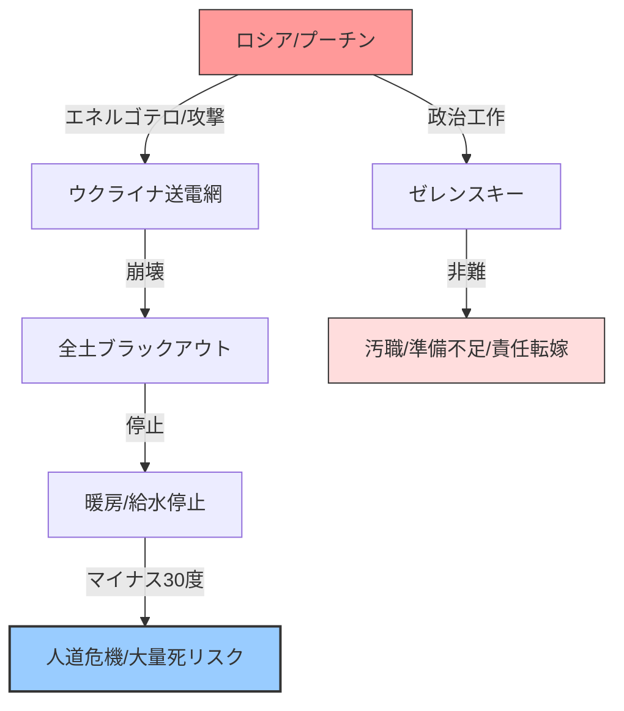

# 🗞️ [Scrap] ウクライナ全土ブラックアウト：極寒マイナス30度の人道危機

**Source**: [YouTube Video](https://www.youtube.com/watch?v=DuK6q4G4-4Q)
**Channel**: BOGDAN in Ukraine (https://www.youtube.com/@BOGDAN_Ukraine)
**Upload Date**: 2026-02-03
**View Count**: 33,835
**Date**: 2026-02-03
**Tags**: #政治 #ウクライナ #ロシア #戦争 #ブラックアウト #人道危機 #BOGDAN

## 📝 概要 (Executive Summary)
2026年1月31日、ウクライナ全土で史上初の一斉ブラックアウトが発生。外気温がマイナス30度に迫る中、電力・暖房・給水が完全停止する極めて深刻な危機に直面している。
ロシアによる「冷却戦略（エネルゴテロ）」に加え、ウクライナ政府・インフラ側の準備不足や汚職、リスク管理の欠如が被害を拡大させている実態が詳しく報告されている。
和平交渉の裏で、ウクライナを凍死によって屈服させ、ロシアの「属領」として印象付けるプーチン政権の冷酷な政治工作が浮き彫りになっている。

## 🔍 詳細トピック (Key Topics)

### 1. カスケード型ブラックアウトの発生
- 主要な送電網2系統（ルーマニア方面と東西を結ぶ幹線）の事故により、過電圧保護が自動作動、全国的な連鎖停止（ブラックアウト）に至った。
- 中央給水もポンプ停止により完全停止。キーウなどの都市部で暖房パイプが凍結・破裂すれば、復旧は絶望的となる。

### 2. 「現代版ホロドモール」：ロシアの冷却戦略
- ロシア下院では、停戦交渉の拒否に対する報復として「マイナス30度の懲罰（凍死報復）」を求める声が上がっている。
- ゼレンスキー大統領に対し、安全を保証する名目で「モスクワ訪問」を要求。これはウクライナを実質的な属国として世界に誇示するプロパガンダ工作である。

### 3. ウクライナ国内の構造的問題
- 支援された発電機が認証プロセスの停滞で稼働していない問題や、政府と地方都市（キーウ市長ら）の責任のなすりつけ合いを指摘。
- 戦争中であるにもかかわらず、インフラの分散化やバックアップ体制の構築を怠ってきた政府への国民の不満が高まっている。



---

## 📊 Mapping Metadata
```json
{
  "scraped_at": "2026-02-03",
  "project_tags": ["Political"],
  "source": {
    "platform": "YouTube",
    "channel": "BOGDAN in Ukraine",
    "url": "https://www.youtube.com/watch?v=DuK6q4G4-4Q",
    "source_bias": {
      "anti_ds": 0.3,
      "establishment": -0.4,
      "tone_optimism": -0.7
    }
  },
  "entities": [
    {"name": "Vladimir Putin", "stance": "Aggressor (Infraterrorism)", "sentiment": -1.0},
    {"name": "Volodymyr Zelenskyy", "stance": "Defender (Internal Issues)", "sentiment": -0.3},
    {"name": "Vitali Klitschko", "stance": "Kyiv Mayor (Conflicts w/ Gov)", "sentiment": -0.2}
  ],
  "reliability_score": 0.85,
  "tags": ["Ukraine", "Blackout", "HumanitarianCrisis", "RussiaAttack"]
}
```
