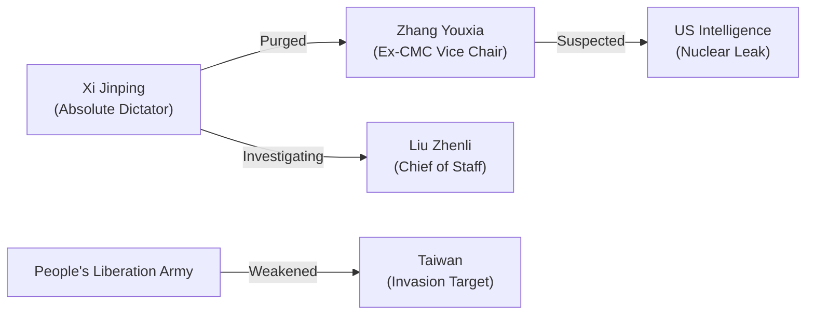

# 📄 YouTube Analysis Scrap: Xi Jinping's Military Purge Analysis

🗞️ **[Scrap] 習近平による軍事委員会粛清の舞台裏**
- **Source**: [YouTube Video](https://www.youtube.com/watch?v=lzHJBv70N3U)
- **Channel**: 深田萌絵TV (https://www.youtube.com/@FukadaMoeTV)
- **Upload Date**: 2025-10-27
- **View Count**: 68,554
- **Date**: 2026-02-04
- **Tags**: #政治 #中国 #習近平 #粛清 #人民解放軍 #深田萌絵


## 概要
習近平国家主席による中央軍事委員会（CMC）の大規模な粛清について、深田萌絵氏が技術・経済的背景から分析。特に張又侠副主席と劉振立参謀長の失脚が、台湾侵攻計画の対立や核情報の流出疑惑と結びついている点に注目。

## 詳細トピック
- **CMCの機能不全**: 7名中5名が失脚あるいは調査対象。習近平が軍の完全掌握を急ぐ一方、PLAの意思決定能力は著しく低下。
- **粛清の引き金**: 張又侠氏が核機密を米国に流出させた疑いや、台湾の離島を占領する「局地戦」を提案して習近平に拒絶された経緯。
- **クーデターへの恐怖**: 2026年1月からの急激な動きは、軍内部の反乱（クーデター）を未然に防ぐための予防的措置。
- **技術・インテリジェンス**: ファーウェイや半導体問題と同様、軍内部の利権と技術流出が権力闘争の道具となっている。

## 🕸️ 勢力・関連図 (Network Map)


## Mapping Metadata
```json
{
  "project_tags": ["Political"],
  "source": {
    "platform": "YouTube",
    "channel": "深田萌絵TV",
    "url": "https://www.youtube.com/watch?v=lzHJBv70N3U",
    "source_bias": {
      "anti_ds": 0.5,
      "establishment": -0.6,
      "tone_optimism": -0.5
    }
  },
  "entities": [
    {"name": "Xi Jinping", "stance": "Insecure Purger", "sentiment": -0.8},
    {"name": "Zhang Youxia", "stance": "Fallen Inner Circle", "sentiment": -0.4},
    {"name": "人民解放軍", "stance": "Weakened Institution", "sentiment": -0.6},
    {"name": "習近平", "stance": "Ruthless Consolidator", "sentiment": -0.8}
  ]
}
```
