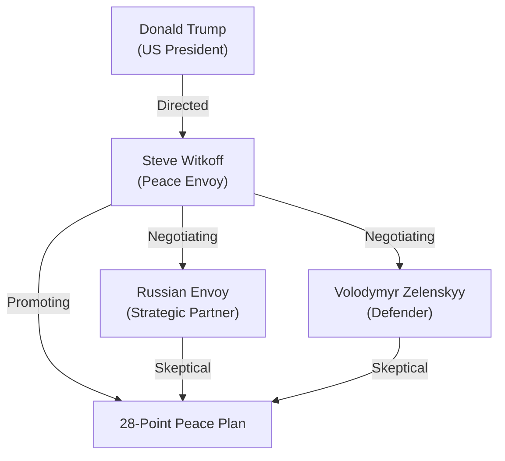

# 📄 YouTube Analysis Scrap: Trump's Peace Envoy in Abu Dhabi

🗞️ **[Scrap] トランプ和平特使のアブダビ外交**
- **Source**: [YouTube Video](https://www.youtube.com/watch?v=FQH_D_o71Ug)
- **Channel**: Sky News Australia (https://www.youtube.com/@SkyNewsAustralia)
- **Upload Date**: 2025-10-20
- **View Count**: 1,601
- **Date**: 2026-02-04
- **Tags**: #政治 #外交 #トランプ #ウクライナ #和平交渉 #アブダビ

## 概要
2026年2月初旬にアブダビで開催されたロシア・ウクライナ和平交渉について、トランプ大統領の特使スティーブ・ウィトコフ氏の活動を中心に報告。トランプ政権が提唱する「28項目の和平案」の進捗と、領土問題を巡る難航する議論が焦点。

## 詳細トピック
- **スティーブ・ウィトコフ氏の役割**: 個人的なコネクションを重視した「人間対人間」の交渉スタイル。
- **和平交渉の現状**: ロシア and ウクライナの代表団がアブダビで直接対談。トランプ外交の「Back on Track」を強調。
- **領土問題の壁**: ドンバスとクリミアの帰属を巡る妥協案（NATO不加盟の誓約など）が議論されているが、ウクライナ側は主権保護を譲らない構え。

## 🕸️ 勢力・関連図 (Network Map)


## Mapping Metadata
```json
{
  "project_tags": ["Political"],
  "source": {
    "platform": "YouTube",
    "channel": "Sky News Australia",
    "url": "https://www.youtube.com/watch?v=FQH_D_o71Ug",
    "source_bias": {
      "anti_ds": 0.2,
      "establishment": 0.6,
      "tone_optimism": 0.5
    }
  },
  "entities": [
    {"name": "Donald Trump", "stance": "Peace Broker / Mastermind", "sentiment": 0.5},
    {"name": "Steve Witkoff", "stance": "Personal Negotiator", "sentiment": 0.7},
    {"name": "Vladimir Putin", "stance": "Tough Negotiator", "sentiment": -0.1},
    {"name": "Volodymyr Zelenskyy", "stance": "Critical Participant", "sentiment": 0.2}
  ]
}
```
