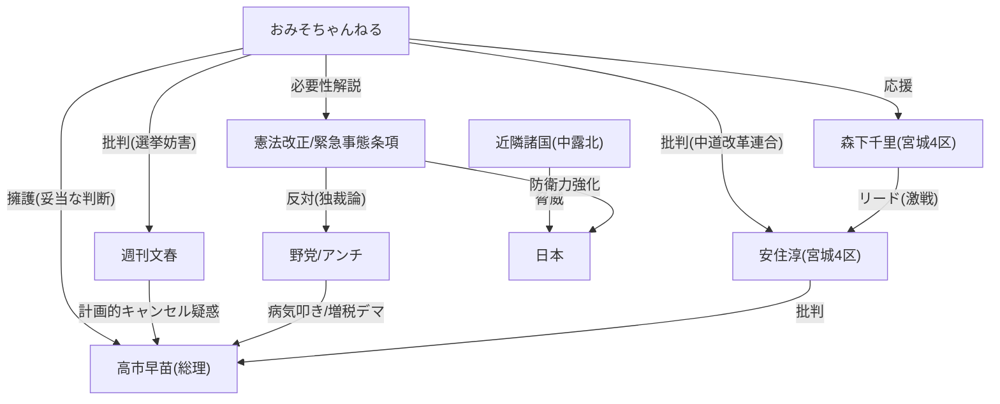

# 【宮城4区】まさかの展開来てしまいました…

🗞️ **[Scrap] おみそちゃんねる：高市早苗の討論会キャンセル騒動と宮城4区情勢**
- **Source**: [YouTube Video](https://www.youtube.com/watch?v=PH5v6hd5n4M)
- **Channel**: [おみそちゃんねる【世界どん深闇ニュース】](https://www.youtube.com/@omisochannnel)
- **Upload Date**: 2026-02-04
- **View Count**: 180,900
- **Date**: 2026-02-05
- **Tags**: #高市早苗 #安住淳 #森下千里 #憲法改正 #緊急事態条項

## 概要
おみそちゃんねるが、高市早苗総理のNHK党首討論キャンセル騒動と、宮城4区の選挙情勢について解説。
文春砲による「キャンセル計画説」を、消費税12%デマと同種の政権攻撃であると批判。
激戦の宮城4区では、立憲民主党の安住淳氏を森下千里氏（自民）がリードしたとの情報に触れ、中道改革連合の危険性を訴える。

## 詳細トピック
- **党首討論キャンセル問題**:
    - 高市総理が持病悪化を理由にNHK討論をキャンセルした件に対し、文春が「2日前から計画されていた」と報道。
    - おみそ氏は「2日前からの体調不良ならキャンセル検討は妥当」とし、これを攻撃材料にする野党や週刊誌を選挙妨害と批判。
    - 「政府官邸内のアンチ高市勢力」によるリークの可能性を指摘。
- **消費税12%デマと広告費批判**:
    - ネットで拡散する「消費税12%」説は完全なデマであると断言。
    - 自民党のYouTube広告（9000万再生）への税金投入批判についても、政党交付金は全政党に使われており、論点がズレていると反論。
- **宮城4区の激戦**:
    - 立憲民主党の大幹部・安住淳氏に対し、自民党の森下千里氏がリードしたとの情報を紹介。
    - 安住氏がライバルの病気を批判する姿勢に苦言。
    - 安住氏が「中道改革連合にはれいわ新選組も協力」と発言（後に訂正）した件を取り上げ、野党共闘の綻びや矛盾を指摘。
- **憲法改正と緊急事態条項**:
    - 「緊急事態条項＝独裁」論をデマとし、本来は震災等の有事における司令系統確保が目的であると解説。
    - 近隣諸国（中・露・北）の脅威に対抗するためには、防衛体制の整備と憲法改正が必要であり、これを阻む勢力こそ日本の弱体化を望んでいると主張。

## 🕸️ 勢力・関連図 (Network Map)


## 📊 Mapping Metadata
```json
{
  "scraped_at": "2026-02-05",
  "project_tags": ["Political"],
  "source": {
    "platform": "YouTube",
    "channel": "おみそちゃんねる【世界どん深闇ニュース】",
    "url": "https://www.youtube.com/watch?v=PH5v6hd5n4M",
    "source_bias": {
      "anti_ds": 0.5,
      "establishment": -0.6,
      "tone_optimism": 0.4
    }
  },
  "entities": [
    {"name": "高市早苗", "stance": "Defender", "sentiment": 1.0},
    {"name": "週刊文春", "stance": "Accuser", "sentiment": -0.8},
    {"name": "安住淳", "stance": "Target", "sentiment": -0.7},
    {"name": "森下千里", "stance": "Defender", "sentiment": 0.9},
    {"name": "自民党", "stance": "Tool", "sentiment": 0.5},
    {"name": "憲法改正", "stance": "Defender", "sentiment": 0.9}
  ]
}
```
