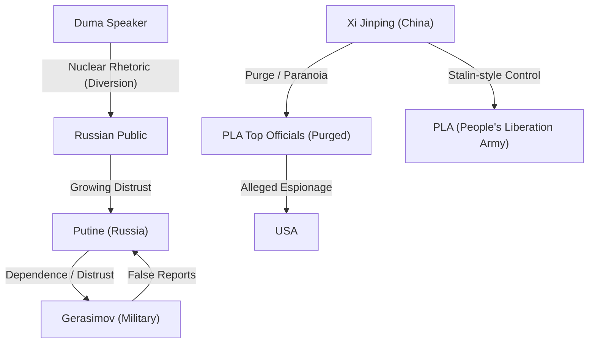

# 📄 YouTube解æスクラップ: ロシア下院è¡æ’ƒç™ºè¨€ï¼æ ¸æ”»æ’ƒã‚’è­°é•·ãŒè¦æ±‚ï¼ä¸­å›½è»éƒ¨ã®ç²›æ¸…

ğŸ—ï¸ **[Scrap] ロシア下院議長ã®æ ¸ä½¿ç”¨è¦æ±‚ã¨ä¸­å›½è»é«˜å®˜ã®ç›¸æ¬¡ã粛清**
- **元ソース**: [ã€ã‚†ã£ãり解説】ロシア下院è¡æ’ƒç™ºè¨€ï¼æ ¸æ”»æ’ƒã‚’è­°é•·ãŒè¦æ±‚…プーãƒãƒ³ã¤ã„ã«æœ€çµ‚判断ã‹ã€‚](https://www.youtube.com/watch?v=vleZEMT_m78)
- **ãƒãƒ£ãƒ³ãƒãƒ«**: [ゆã£ãり防衛ãƒãƒ£ãƒ³ãƒãƒ«](https://www.youtube.com/@yukkuriboei)
- **投稿日**: 2026-02-05
- **視è´å›æ•°**: 20798
- **解ææ—¥**: 2026-02-05
- **ã‚¿ã‚°**: #自衛隊 #ゆã£ãã‚Š #海外ã®åå¿œ #ロシア #中国 #核兵器 #粛清

## 概è¦
ロシア下院議長ãŒSNS（Telegram）ã§ã€Œå ±å¾©å…µå™¨ï¼ˆæ ¸å…µå™¨ï¼‰ã€ã®ä½¿ç”¨ã‚’公然ã¨è¦æ±‚。ã“ã‚Œã¯æˆ¦æ³ã®åœæ»ã‚„国内ã®ä¸æº€ï¼ˆãƒ—ーãƒãƒ³æ”¯æŒå±¤ã®é›¢åã€è»éƒ¨ã®è™šå½å ±å‘Šã¸ã®æ€’り）を外部ã¸é€¸ã‚‰ã™ãŸã‚ã®ã€Œã‚¬ã‚¹æŠœãã€ãŠã‚ˆã³å°è±¡æ“作ã§ã‚ã‚‹ã¨ã®åˆ†æ。
一方ã€ä¸­å›½ã§ã¯äººæ°‘解放è»ã®åˆ¶æœçµ„トップ（劉振立æ°ã¨æ¨å®šã•ã‚Œã‚‹æ–‡è„ˆï¼‰ãŒç±³å´ã¸ã®æƒ…å ±æ¼æ´©ã¨æ±šè·ç–‘惑ã§å¤±è„šã€‚習近平国家主席ã¯ç–‘心暗鬼ã«é™¥ã‚Šã€è»éƒ¨ã¸ã®ç²›æ¸…を強化ã—ã¦ã„る。内部クーデター未é‚ã®å™‚ã‚‚ã‚ã‚Šã€ç‹¬è£ä½“制ã®ä¸å®‰å®šåŒ–ãŒæŒ‡æ‘˜ã•ã‚Œã‚‹ã€‚

## 詳細トピック
- **ロシア下院議長ã®æ ¸ç™ºè¨€**:
    - 通常ã€æ ¸ã¸ã®è¨€åŠã¯å¤§çµ±é ˜ã‚„ドクトリンã«é™ã‚‰ã‚Œã‚‹ãŒã€è­°é•·ãŒSNSã§ç™ºä¿¡ã™ã‚‹ã®ã¯ç•°ä¾‹ã€‚
    - 国内å‘ã‘ã®ãƒ‘フォーãƒãƒ³ã‚¹ï¼ˆå¼·ç¡¬å§¿å‹¢ã®ã‚¢ãƒ”ール）ã®å´é¢ãŒå¼·ã„。
    - é »ç¹ãªæ ¸ã®è„…ã—ã¯ã€Œç‹¼å°‘å¹´ã€åŒ–ã—ã€é€†ã«ãƒ­ã‚·ã‚¢ã®å¤–交的孤立（晴れ物扱ã„）ã¨çµŒæ¸ˆåˆ¶è£ã®å¼·åŒ–ã‚’æ‹›ãリスクãŒã‚る。
- **ロシアè»éƒ¨ã®è…æ•—**:
    - ゲラシモフå‚謀ç·é•·ã‚‰ã«ã‚ˆã‚‹æˆ¦æœã®æ°´å¢—ã—報告（虚å½å ±å‘Šï¼‰ãŒæ¨ªè¡Œã€‚
    - 実際ã«ã¯åˆ¶åœ§ã—ã¦ã„ãªã„地域を「制圧ã—ãŸã€ã¨å ±å‘Šã—ã€ç„¡è¬€ãªçªæ’ƒå‘½ä»¤ã‚’正当化ã—ã¦ã„る。
    - ã“ã‚Œã«ã‚ˆã‚Šã€Œãƒ—ーãƒãƒ³ã¯æ‚ªããªã„ãŒå–ã‚Šå·»ããŒæ‚ªã„ã€ã¨ã„ã†å¾“æ¥ã®æ”¯æŒå±¤ã®è«–ç†ãŒå´©ã‚Œã€ãƒ—ーãƒãƒ³ã®ä»»å‘½è²¬ä»»ã‚„判断能力ã¸ã®æ‰¹åˆ¤ãŒé«˜ã¾ã£ã¦ã„る。
- **中国è»éƒ¨ã®ç²›æ¸…**:
    - è»åˆ¶æœçµ„トップレベルã®äººé–“ãŒã€æ ¸æ©Ÿç±³å´ã¸ã®å¯†å£²ï¼ˆæƒ…å ±æ¼æ´©ï¼‰ãŠã‚ˆã³å·¨é¡ã®è³„賂疑惑ã§å¤±è„šã€‚
    - 習近平主席ã¯ã“れを「個人的ãªè£åˆ‡ã‚Šã€ã‹ã¤ã€Œå›½å®¶å®‰å…¨ä¿éšœä¸Šã®è„…å¨ã€ã¨æ‰ãˆã€ã‚¹ã‚¿ãƒ¼ãƒªãƒ³å¼ã®å¾¹åº•çš„ãªç²›æ¸…（å¤ã„世代ã®æ’除ã¨ã‚¤ã‚¨ã‚¹ãƒãƒ³ã¸ã®å…¥ã‚Œæ›¿ãˆï¼‰ã‚’進ã‚ã¦ã„る。
    - 1月18æ—¥ã«ã¯ã‚¯ãƒ¼ãƒ‡ã‚¿ãƒ¼æœªé‚（習近平拘æŸè¨ˆç”»ï¼‰ãŒã‚ã£ãŸã¨ã®å™‚ã‚‚ã‚ã‚Šã€ç¿’è¿‘å¹³æ°ã¯è­¦å‚™ã‚’å³é‡åŒ–ã—ã€å¼•ãã“もり状態ã«ã‚ã‚‹ã¨ã•ã‚Œã‚‹ã€‚

## ğŸ•¸ï¸ å‹¢åŠ›ãƒ»ç›¸é–¢å›³ (ãƒãƒƒãƒˆãƒ¯ãƒ¼ã‚¯ãƒãƒƒãƒ—)

```mermaid
graph TD
    Putin["Putine (Russia)"] -- "Dependence / Distrust" --> Gerasimov["Gerasimov (Military)"]
    Gerasimov -- "False Reports" --> Putin
    Duma_Speaker["Duma Speaker"] -- "Nuclear Rhetoric (Diversion)" --> Russian_Public["Russian Public"]
    Russian_Public -- "Growing Distrust" --> Putin

    Xi_Jinping["Xi Jinping (China)"] -- "Purge / Paranoia" --> PLA_Top["PLA Top Officials (Purged)"]
    PLA_Top -- "Alleged Espionage" --> USA["USA"]
    Xi_Jinping -- "Stalin-style Control" --> PLA["PLA (People's Liberation Army)"]
```

## 📊 ãƒãƒƒãƒ”ング用メタデータ (Mapping Metadata)
※ã“ã®ã‚»ã‚¯ã‚·ãƒ§ãƒ³ã®JSON構造（キーå）ã¯ã‚·ã‚¹ãƒ†ãƒ ãŒèª­ã¿å–ã‚‹ãŸã‚変更ã—ãªã„ã§ãã ã•ã„。

```json
{
  "project_tags": ["Political"],
  "source": {
    "platform": "YouTube",
    "channel": "ゆã£ãり防衛ãƒãƒ£ãƒ³ãƒãƒ«",
    "url": "https://www.youtube.com/watch?v=vleZEMT_m78",
    "source_bias": {
      "anti_ds": 0.0,
      "establishment": 0.5,
      "tone_optimism": 0.1
    }
  },
  "entities": [
    {"name": "Vladimir Putin", "stance": "Weakened Authority", "sentiment": -0.5},
    {"name": "Russian Duma Speaker", "stance": "Aggressive Rhetoric", "sentiment": -0.8},
    {"name": "Valery Gerasimov", "stance": "Corrupt/Incompetent", "sentiment": -0.9},
    {"name": "Xi Jinping", "stance": "Paranoid/Authoritarian", "sentiment": -0.8},
    {"name": "PLA Top Brass", "stance": "Purged/Corrupt", "sentiment": -0.7}
  ]
}
```
