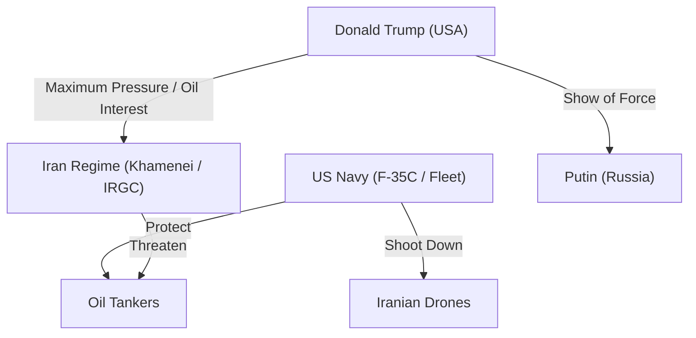

# 📄 YouTube解析スクラップ: 米国とイランの戦争危機・米軍F-35実戦投入

🗞️ **[Scrap] 米海軍F-35Cによるイラン・ドローン撃墜とトランプ政権の対中東戦略**
- **元ソース**: [米国とイランの戦争が、いつ始まってもおかしくない状況です。](https://www.youtube.com/watch?v=TtkJtPGv27g)
- **チャンネル**: [BOGDAN in Ukraine](https://www.youtube.com/@BOGDAN_Ukraine)
- **投稿日**: 2026-02-05
- **視聴回数**: 7873
- **解析日**: 2026-02-05
- **タグ**: #ウクライナ #ロシア #イラン #米軍 #F35 #トランプ #石油利権

## 概要
米海軍F-35Cがアラビア海上空でイラン製ドローン「シャヘド」を撃墜（同機による初の実戦撃墜）。同時にホルムズ海峡での石油タンカー拿捕未遂を米艦隊が阻止した。
トランプ政権下、米軍は過去20年で最大規模（17-18隻の艦隊、トマホーク600発以上）で中東に展開中。トランプ大統領の狙いは「民主主義の拡大」ではなく「石油利権の確保」および「圧倒的な武力による早期決着（または交渉の有利化）」にあると分析される。

## 詳細トピック
- **F-35Cの実戦初撃墜**:
    - 空母エイブラハム・リンカーン艦載のF-35Cが、空母に接近するイラン製ドローン「シャヘド」を迎撃・撃墜した。
    - ハイエンド機（F-35）での安価なドローン撃墜はコストパフォーマンス（費用対効果）の面で課題も指摘される（飽和攻撃への対応力疑問）。
- **ホルムズ海峡の緊張**:
    - イラン小型高速艇が高給タンカーへ接近・拿捕を試みたが、米艦隊の介入により失敗。
    - 偶発的な衝突ではなく、軍事的な対峙構造が明確化している。
- **トランプ政権の戦略**:
    - **大規模展開**: 過去20年で最大規模の艦隊を展開。B-2、B-52などの戦略爆撃機も投入準備。
    - **目的**: イラン現体制の崩壊（レジームチェンジ）または石油利権の掌握。民主主義や人権擁護は二の次で、実利（原油）と「強いアメリカ」の演出（選挙対策・プーチンへの牽制）が主眼。
    - **シナリオ**: 地上戦の準備は整っておらず、空爆とミサイルによる「一撃」での体制崩壊あるいは暫定政権樹立（パフラヴィー氏擁立など）を目論んでいる可能性がある。
- **イラン側の脆弱性**:
    - イスラエルによる過去の空爆時、イランの防空システム（ロシア製）は機能しなかった。
    - 経済疲弊と国内弾圧により体制基盤は盤石ではない。

## 🕸️ 勢力・相関図 (ネットワークマップ)


## 📊 マッピング用メタデータ (Mapping Metadata)
※このセクションのJSON構造（キー名）はシステムが読み取るため変更しないでください。

```json
{
  "project_tags": ["Political"],
  "source": {
    "platform": "YouTube",
    "channel": "BOGDAN in Ukraine",
    "url": "https://www.youtube.com/watch?v=TtkJtPGv27g",
    "source_bias": {
      "anti_ds": 0.0,
      "establishment": 0.6,
      "tone_optimism": 0.2
    }
  },
  "entities": [
    {"name": "Donald Trump", "stance": "Aggressive/Pragmatic", "sentiment": 0.2},
    {"name": "Iran Regime", "stance": "Anti-West/Vulnerable", "sentiment": -0.8},
    {"name": "US Navy", "stance": "Dominant", "sentiment": 0.5},
    {"name": "Vladimir Putin", "stance": "Watcher", "sentiment": -0.2}
  ]
}
```
