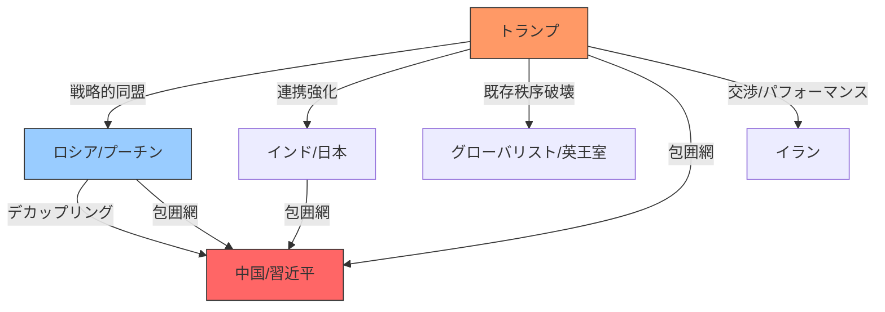

# 🗞️ [Scrap] トランプの世界秩序破壊：イギリス一極支配からの脱却と中路デカップリング

**Source**: [YouTube Video](https://www.youtube.com/watch?v=TkdqnXLAZfs)
**Channel**: 金子吉友の反DSチャンネル『あつまれニュースの森』 (https://www.youtube.com/@kaneko.)
**Upload Date**: 2026-02-03
**View Count**: 6,418
**Date**: 2026-02-03
**Tags**: #政治 #トランプ #地政学 #イラン #ロシア #中国 #DS分析

## 📝 概要 (Executive Summary)
トランプ大統領が目指す「既存の世界秩序（イギリス主導の一極支配体制）の破壊」と、その裏にある新地政学戦略を解説。
イランへの軍事的威嚇をパフォーマンスとし、プーチン大統領を通じた仲介によって戦争を回避する「アクロバティックな外交」の裏側を分析。
その究極の目的は、ロシアを西側に引き込むことで「中路デカップリング（中国とロシアの切り離し）」を実現し、日本・インド・ロシア・アメリカの包囲網で中国を封じ込めることにあるとしている。

## 🔍 詳細トピック (Key Topics)

### 1. イラン情勢の「茶番」と平和的解決
- 米空母エイブラハム・リンカーンによる威嚇はイスラエル向けのポーズであり、実際にはロシアの仲介による核交渉の続行が合意されている。
- トランプ氏はイラン体制転覆ではなく、あくまでコントロール下に置くことを狙っている。

### 2. トランプの新世界秩序：中路デカップリング
- ロシアにウクライナでの妥協案や北極圏共同開発を提示し、中国から引き剥がす戦略。
- 日本、インド、ロシア、アメリカが連携し、中国を封じ込める「西半球砦」構想。

### 3. エプスタイン文書と既存勢力の崩壊
- 文書公開は、ビル・ゲイツや英王室など既存のエリート層（DS）を失脚させ、古いシステムを解体するための手段であるという見方。
- 次期FRB議長候補に指名されたケビン・ウォーシュ氏ら、シオニスト勢力への権力移行についても言及。



---

## 📊 Mapping Metadata
```json
{
  "scraped_at": "2026-02-03",
  "project_tags": ["Political"],
  "source": {
    "platform": "YouTube",
    "channel": "あつまれニュースの森",
    "url": "https://www.youtube.com/watch?v=TkdqnXLAZfs",
    "source_bias": {
      "anti_ds": 0.9,
      "establishment": -0.8,
      "tone_optimism": 0.4
    }
  },
  "entities": [
    {"name": "Donald Trump", "stance": "Disrupter of Old Order", "sentiment": 0.8},
    {"name": "Vladimir Putin", "stance": "Strategic Partner", "sentiment": 0.7},
    {"name": "Xi Jinping", "stance": "Target of Containment", "sentiment": -0.9},
    {"name": "Globalists (DS)", "stance": "Old System Holders", "sentiment": -1.0}
  ],
  "reliability_score": 0.5,
  "tags": ["Geopolitics", "TrumpStrategy", "RussiaPartnership", "ContainmentChina"]
}
```
命じる。
