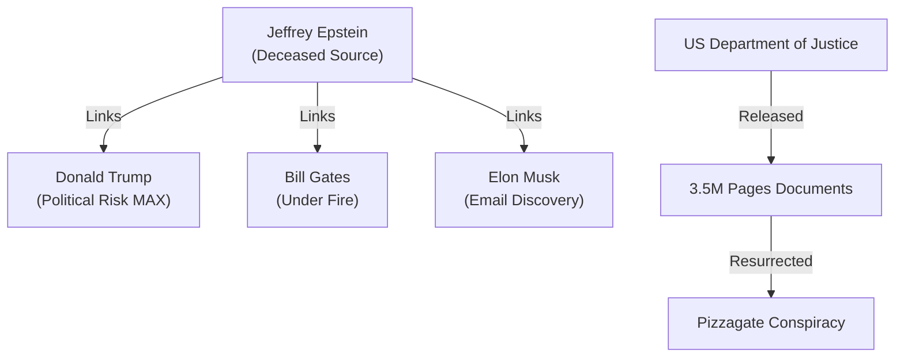

# 📄 YouTube Analysis Scrap: Epstein 3M Documents & Trump Scandals

🗞️ **[Scrap] 300万ページの新エプスタイン文書：トランプと億万長者のリスク**
- **Source**: [YouTube Video](https://www.youtube.com/watch?v=c4UeetTkfxU)
- **Channel**: BOGDAN in Ukraine (https://www.youtube.com/@BOGDAN_Ukraine)
- **Upload Date**: 2026-02-03
- **View Count**: 20,333
- **Date**: 2026-02-04
- **Tags**: #政治 #エプスタイン文書 #トランプ #ビルゲイツ #イーロンマスク #アメリカ

## 概要
2026年1月30日に米司法省が公開した300万ページに及ぶ「新エプスタイン文書」について報告。トランプ大統領の名が3000回以上登場することによる政治的リスクと、ゲイツ氏やマスク氏の関与疑惑、さらには文書中の「コード」を巡る陰謀論の再燃を分析。

## 詳細トピック
- **トランプ絶体絶命説**: 3000回以上の言及。13歳少女への関与証言やニュージャージーのゴルフ場での不穏な噂。
- **億万長者の影**: ビル・ゲイツ氏のロシア人女性関係や、イーロン・マスク氏の島訪問計画メール。両名とも否定しているが、文書内での言及頻度は高い。
- **ピザゲートの再燃**: 文書内に「Pizza」という単語が多く含まれていることから、かつての陰謀論がSNS（XやThreads）で再拡大。

## 🕸️ 勢力・関連図 (Network Map)


## Mapping Metadata
```json
{
  "project_tags": ["Political"],
  "source": {
    "platform": "YouTube",
    "channel": "BOGDAN in Ukraine",
    "url": "https://www.youtube.com/watch?v=c4UeetTkfxU",
    "source_bias": {
      "anti_ds": 0.4,
      "establishment": -0.4,
      "tone_optimism": -0.8
    }
  },
  "entities": [
    {"name": "Donald Trump", "stance": "Scandal Target", "sentiment": -0.7},
    {"name": "Bill Gates", "stance": "Exposed Associate", "sentiment": -0.8},
    {"name": "Elon Musk", "stance": "Questionable Respondent", "sentiment": -0.5},
    {"name": "Globalists (DS)", "stance": "Systemic Corruptors", "sentiment": -1.0}
  ]
}
```
