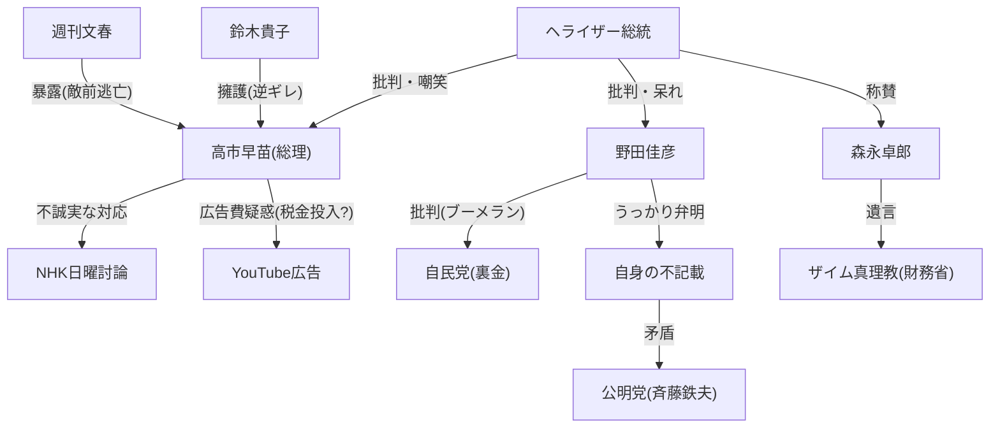

# 【文春砲】高市総理「嘘」発覚？内部告発でバレた敵前逃亡！野田佳彦「うっかり」発言で特大ブーメラン直撃！

🗞️ **[Scrap] ヘライザー総統：高市総理の討論ドタキャン疑惑と野田佳彦の「うっかり」発言**
- **Source**: [YouTube Video](https://www.youtube.com/watch?v=YIeyv8hElco)
- **Channel**: [悪の秘密ぼっち「ヘライザー総統」と言う名のファンタジー](https://www.youtube.com/@heraizz)
- **Upload Date**: 2026-02-04
- **View Count**: 31,913
- **Date**: 2026-02-04
- **Tags**: #高市早苗 #野田佳彦 #文春砲 #ザイム真理教 #ブーメラン

## 概要
高市総理がNHK日曜討論を「手の怪我」を理由に欠席した件について、文春報道を引用し「実は2日前からキャンセルを画策していた敵前逃亡」と批判。
一方、野田佳彦氏が自身の政治資金不記載を「うっかり」と弁明したことに対し、公明党の1億円不記載を擁護することになると矛盾を指摘。
最後に故・森永卓郎氏の「ザイム真理教」の言葉を引用し、消費税や財政問題への懸念を示唆。

## 詳細トピック
- **高市総理の討論欠席疑惑**:
    - 公式発表は演説中の手の怪我だが、文春によると放送2日前の金曜時点で代打出演（小林鷹之氏、田村憲久氏）を打診していた。
    - 同日午後の地方演説は予定通りこなしており、「逃げた」との印象を与えた。
    - 鈴木貴子広報本部長の「公的討論番組ではない」という擁護も火に油を注ぐ結果に。
- **広告費疑惑**:
    - 高市氏のYouTubeショート動画が異常な再生数（約9000万回）を記録。
    - 専門家の推測として、2億〜7億円の広告費が投入されている可能性があり、その原資（政党交付金＝税金）が疑われている。
- **野田佳彦氏のブーメラン**:
    - 裏金問題を「組織ぐるみのちゃっかり」と批判しつつ、自身の不記載を「うっかり」と弁明。
    - 公明党・斉藤鉄夫代表の1億円超の不記載も「うっかり」で済まされるのかという矛盾。
    - 衆院選情勢調査で自公過半数割れの可能性が低いことへの焦り。
- **経済・労働問題**:
    - 「働きたい」正規・非正規雇用者が多数いる中、外国人労働者受け入れを進める政策により、日本人の賃金が上がらない構造を批判。
    - 森永卓郎氏の「ザイム真理教」という言葉を警鐘として紹介。

## 🕸️ 勢力・関連図 (Network Map)


## 📊 Mapping Metadata
```json
{
  "scraped_at": "2026-02-04",
  "project_tags": ["Political"],
  "source": {
    "platform": "YouTube",
    "channel": "悪の秘密ぼっち「ヘライザー総統」と言う名のファンタジー",
    "url": "https://www.youtube.com/watch?v=YIeyv8hElco",
    "source_bias": {
      "anti_ds": 0.3,
      "establishment": -0.8,
      "tone_optimism": -0.5
    }
  },
  "entities": [
    {"name": "高市早苗", "stance": "Target", "sentiment": -0.8},
    {"name": "野田佳彦", "stance": "Target", "sentiment": -0.7},
    {"name": "鈴木貴子", "stance": "Defender", "sentiment": -0.6},
    {"name": "森永卓郎", "stance": "Accuser", "sentiment": 0.9},
    {"name": "財務省", "stance": "Target", "sentiment": -0.9}
  ]
}
```
