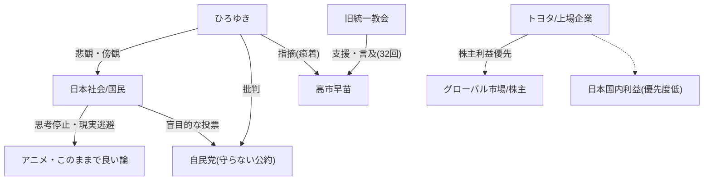

# 2026年の衆院選で日本が終わります。この流れを止めるのは僕にはできませんでした。

🗞️ **[Scrap] ひろゆき：日本の政治不全と国民性への絶望、高市早苗と統一教会の関係**
- **Source**: [YouTube Video](https://www.youtube.com/watch?v=f9sDeWFHOIQ)
- **Channel**: [ひろゆきの政【政治・経済・社会専門切り抜きチャンネル】](https://www.youtube.com/@hiroyuki_matsuri)
- **Upload Date**: 2026-02-02
- **View Count**: 19,279
- **Date**: 2026-02-04
- **Tags**: #ひろゆき #高市早苗 #統一教会 #自民党 #衆院選 #日本経済

## 概要
ひろゆき氏が、日本の政治が変わらない理由として「国民が公約を守らない政治家に投票し続けるから」と指摘。
高市早苗氏が旧統一教会の裁判資料に名前が多数登場している点に触れ、関係性を批判。
最終的に「日本人は致命的な失敗（玉砕）まで変わらない」とし、自身は「傍観モード」に入ったと悲観的な見解を示す。

## 詳細トピック
- **高市早苗と統一教会**:
    - 韓国の裁判所に提出された文書で、高市早苗氏を総理大臣にするための応援に関する記述があり、名前が32回登場していると言及。
- **政治と選挙**:
    - 自民党は「国会議員定数削減」や「減税」を口にするが、結局実行しない。
    - それでも国民が投票するため、政治家は公約を守る必要性を感じない（やってもやらなくても票が入る）。
    - 2026年の衆院選などに触れつつ、根本的な変化は期待薄とする。
- **経済と少子化・移民**:
    - 経済衰退の主因は人口減少。子供を増やし教育に投資すべきだが、正反対の「外国人排除」などの感情論が支持される。
    - 「円安が良い」という誤った認識や、精神論（努力＝正しい）が蔓延。
    - トヨタなどの上場企業は株主利益（外国人株主含む）を優先せざるを得ず、日本国益を第一にはできない構造を解説。
- **日本人の国民性**:
    - インパール作戦を引き合いに、日本人は論理的誤りを認めず、甚大な被害（玉砕）が出るまで突き進むと分析。
    - 学習能力が低く、足し算引き算レベルの議論（誰かのせいにする）に終始し、掛け算（構造改革）を理解しようとしない。
    - アニメなどの「日本の良いところ」に逃避し、現実の貿易赤字から目を背けている。

## 🕸️ 勢力・関連図 (Network Map)


## 📊 Mapping Metadata
```json
{
  "scraped_at": "2026-02-04",
  "project_tags": ["Political"],
  "source": {
    "platform": "YouTube",
    "channel": "ひろゆきの政【政治・経済・社会専門切り抜きチャンネル】",
    "url": "https://www.youtube.com/watch?v=f9sDeWFHOIQ",
    "source_bias": {
      "anti_ds": 0.0,
      "establishment": -0.8,
      "tone_optimism": -0.9
    }
  },
  "entities": [
    {"name": "高市早苗", "stance": "Target", "sentiment": -0.5},
    {"name": "統一教会", "stance": "Involved", "sentiment": -0.9},
    {"name": "自民党", "stance": "Target", "sentiment": -0.8},
    {"name": "トヨタ", "stance": "Involved", "sentiment": 0.0},
    {"name": "日本国民", "stance": "Target", "sentiment": -0.9}
  ]
}
```
