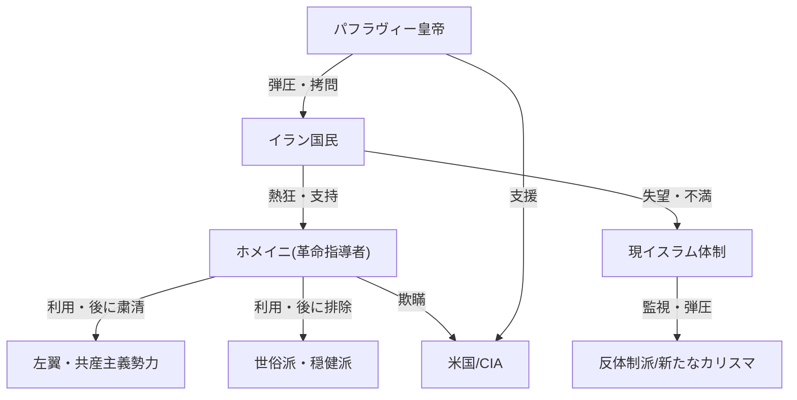

# 【独裁国家の闇】ゼロからわかるイラン・イスラーム体制の正体

🗞️ **[Scrap] イラン・イスラーム体制の成立と独裁の正体：革命の裏切りと生存戦略**
- **Source**: [YouTube Video](https://www.youtube.com/watch?v=2nvHtmzgiI4)
- **Channel**: [元戦場カメラマン・旅野そら](https://www.youtube.com/@tabino_sora_)
- **Upload Date**: 2026-02-02
- **View Count**: 12,014
- **Date**: 2026-02-04
- **Tags**: #イラン #イスラム革命 #ホメイニ #独裁国家 #歴史

## 概要
イラン・イスラーム共和国がなぜ国民の不満や外部の圧力に晒されながらも崩壊しないのかを、建国の歴史から解説。
初代皇帝の西洋化・弾圧に対する反発から始まった革命で、指導者ホメイニがいかにして多様な勢力を利用し、後に粛清して権力を独占したかを詳述。
現体制は「革命の起こし方」を知り尽くしており、新たなカリスマの台頭を許さないことで生存を図っていると分析。

## 詳細トピック
- **パフラヴィー朝の圧政と西洋化**:
    - 初代皇帝レザー・パフラヴィーによる強引な近代化（スカーフ禁止など）と弾圧（マシュハドのモスク虐殺）が、シーア派の反発を招いた。
    - 2代目皇帝はCIAの支援を受け、秘密警察（サバック）による恐怖政治を展開しつつ、石油マネーで「中東のパリ」と呼ばれる繁栄と極度の貧富の差を生んだ。
- **ホメイニの巧みな戦略**:
    - ホメイニは追放中、左翼・共産主義者・世俗派・米国に対し、自身の正体（厳格なイスラム法学者）を隠し、「無害な宗教家」「民主主義者」として振る舞った。
    - "沈黙の戦略"で各勢力に都合の良い幻想を抱かせ、革命の旗印として全勢力を結集させた。
- **革命後の裏切りと粛清**:
    - 革命成就後、ホメイニは豹変。革命防衛隊や革命裁判所を組織し、旧軍部を粛清。
    - 米国大使館占拠事件を利用して穏健派を排除し、反米国家へ転換。
    - さらに共産主義・左翼勢力も「イスラムに反する」として徹底的に弾圧・処刑した。
- **体制の生存理由**:
    - 現体制は革命戦術を知り尽くしており、対抗勢力を結集させる「カリスマ」の出現を徹底的に防いでいるため、国民の不満が高まっても体制崩壊に至らない。

## 🕸️ 勢力・関連図 (Network Map)


## 📊 Mapping Metadata
```json
{
  "scraped_at": "2026-02-04",
  "project_tags": ["Political"],
  "source": {
    "platform": "YouTube",
    "channel": "元戦場カメラマン・旅野そら",
    "url": "https://www.youtube.com/watch?v=2nvHtmzgiI4",
    "source_bias": {
      "anti_ds": 0.5,
      "establishment": -0.5,
      "tone_optimism": -0.2
    }
  },
  "entities": [
    {"name": "ホメイニ", "stance": "Aggressor", "sentiment": -0.9},
    {"name": "パフラヴィー皇帝", "stance": "Aggressor", "sentiment": -0.8},
    {"name": "イラン国民", "stance": "Victim", "sentiment": -0.7},
    {"name": "米国", "stance": "Involved", "sentiment": -0.5},
    {"name": "現イスラム体制", "stance": "Domination", "sentiment": -0.9}
  ]
}
```
