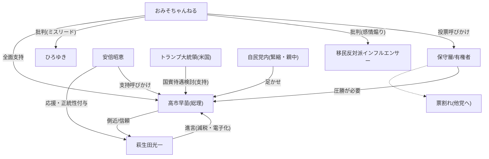

# 【安倍昭恵】遂にあの勢力が動き始めた

🗞️ **[Scrap] おみそちゃんねる：高市早苗支持と安倍昭恵夫人の演説、外国人労働者問題**
- **Source**: [YouTube Video](https://www.youtube.com/watch?v=Qi-Vd5ifr_s)
- **Channel**: [おみそちゃんねる【世界どん深闇ニュース】](https://www.youtube.com/@omisochannnel)
- **Upload Date**: 2026-02-01
- **View Count**: 297,775
- **Date**: 2026-02-04
- **Tags**: #安倍昭恵 #高市早苗 #ひろゆき #外国人労働者 #自民党

## 概要
おみそちゃんねるが、一部のインフルエンサー（ひろゆき等）による「高市政権＝移民推進」という批判はミスリードであると反論。
安倍昭恵夫人が萩生田光一氏の応援演説で「自民党議員でなくては高市成権を支えられない」「他の党に投票してはダメ」と明確に語ったことを紹介し、保守層の票割れ（他党への流出）を懸念。
トランプ政権が高市総理を国賓待遇で迎える検討をしているとし、これは米国の明確な支持表明（内政干渉級）であると主張。

## 詳細トピック
- **外国人労働者問題の誤解**:
    - ひろゆき氏らが「123万人の受け入れ決定」と批判しているが、これは新規数ではなく将来推計値であり、新制度では管理厳格化がなされていると擁護。
    - 賃金が上がらないのは外国人のせいではなく、企業のデフレマインドと内部留保が原因であり、積極財政が必要だと主張。
- **安倍昭恵夫人のメッセージ**:
    - 萩生田光一氏の演説に登壇し、「自民党でなければ高市総理を支えられない」「主人はきっとどこかで応援している」と発言。
    - 萩生田氏はメディアから批判されているが、実は電子レジ普及などの実績があり、減税も進言できる「高市総理の側近」であると再評価。
- **選挙戦略と保守分裂**:
    - 「小選挙区は自民、比例は他党」という呼びかけに対し、それでは高市総理の基盤が弱くなると批判。
    - 自民党内の多様性（親中派なども混在）を認めつつ、高市総理に圧倒的勝利を与えることで、党内の反対勢力（財務省・緊縮派）を封じ込めるべきだと主張。
- **トランプ政権の支持**:
    - 米国が高市総理を国賓待遇で招待する計画があるとし、これは「高市氏以外は役不足」という米国の意思表示（事実上の応援）であると分析。

## 🕸️ 勢力・関連図 (Network Map)


## 📊 Mapping Metadata
```json
{
  "scraped_at": "2026-02-04",
  "project_tags": ["Political"],
  "source": {
    "platform": "YouTube",
    "channel": "おみそちゃんねる【世界どん深闇ニュース】",
    "url": "https://www.youtube.com/watch?v=Qi-Vd5ifr_s",
    "source_bias": {
      "anti_ds": 0.5,
      "establishment": -0.6,
      "tone_optimism": 0.5
    }
  },
  "entities": [
    {"name": "高市早苗", "stance": "Defender", "sentiment": 1.0},
    {"name": "安倍昭恵", "stance": "Defender", "sentiment": 1.0},
    {"name": "萩生田光一", "stance": "Defender", "sentiment": 0.8},
    {"name": "ひろゆき", "stance": "Skeptic", "sentiment": -0.7},
    {"name": "Donald Trump", "stance": "Defender", "sentiment": 0.8},
    {"name": "自民党", "stance": "Tool", "sentiment": 0.3}
  ]
}
```
