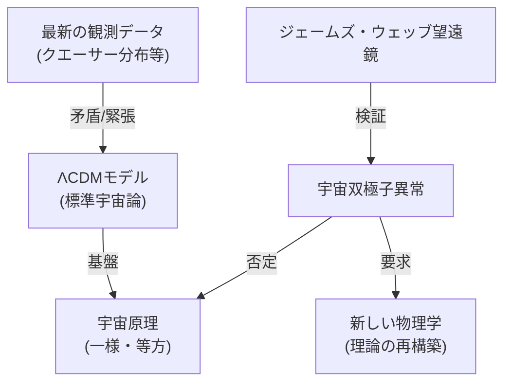

# 📄 YouTube解析スクラップ: 標準宇宙論が根底から崩壊…「宇宙全体の偏り」を検出【宇宙双極子異常】

🗞️ **[Scrap] 宇宙の「偏り」が判明？標準宇宙論の基盤を揺るがす「宇宙双極子異常」の衝撃**
- **元ソース**: [YouTube動画](https://www.youtube.com/watch?v=TqZlFXHV6rU)
- **チャンネル**: 宇宙ヤバイch (https://www.youtube.com/@uchuyabaich)
- **投稿日**: 2026-01-22
- **視聴回数**: 80,088
- **解析日**: 2026-02-04
- **タグ**: #宇宙 #科学 #天文学 #標準宇宙論 #ニュース

## 概要
現在の宇宙論の標準モデル「ΛCDMモデル」の根幹である「宇宙原理（宇宙はどの方向を見ても一様である）」を覆す可能性のある「宇宙双極子異常（Cosmic Dipole Anomaly）」について解説。遠方のクエーサーや銀河の分布に、理論上の予測を大幅に上回る「偏り」が検出されたことで、宇宙論そのものがゼロから再構築される必要性に迫られている。

## 詳細トピック
- **標準モデルの危機**: ビッグバン以来の宇宙進化を説明してきたΛCDMモデルが、近年の観測データの蓄積により「緊張（テンション）」と呼ばれる矛盾に直面している。
- **宇宙原理の否定**: 宇宙は大きなスケールで見れば一様かつ等方的であるはずだが、特定の方向に物質が密集している「偏り」が複数の独立した観測プロジェクト（クエーサー分布など）で確認された。
- **観測結果の衝撃**: 物体分布の偏りの強さが、理論値の約2.7倍に達している。これが偶然である確率は数百万分の一以下とされ、観測ミスでなければ「新しい物理学」の導入が必要となる。
- **今後の展望**: ジェームズ・ウェッブ宇宙望遠鏡をはじめとする次世代プロジェクトにより、さらに精緻なデータが得られる予測。宇宙論のパラダイムシフトが起きるかどうかの瀬戸際にある。

## 🕸️ 勢力・相関図 (ネットワークマップ)


## 📊 マッピング用メタデータ (Mapping Metadata)
```json
{
  "project_tags": ["Science", "Space"],
  "source": {
    "platform": "YouTube",
    "channel": "宇宙ヤバイch",
    "url": "https://www.youtube.com/watch?v=TqZlFXHV6rU",
    "source_bias": {
      "anti_ds": 0.0,
      "establishment": 0.8,
      "tone_optimism": 0.2
    }
  },
  "entities": [
    {"name": "標準宇宙論 (ΛCDM)", "stance": "主流派モデル (危機)", "sentiment": 0.0},
    {"name": "宇宙原理", "stance": "否定されつつある前提", "sentiment": -0.5},
    {"name": "宇宙双極子異常", "stance": "新発見の観測事実", "sentiment": 0.5}
  ]
}
```
