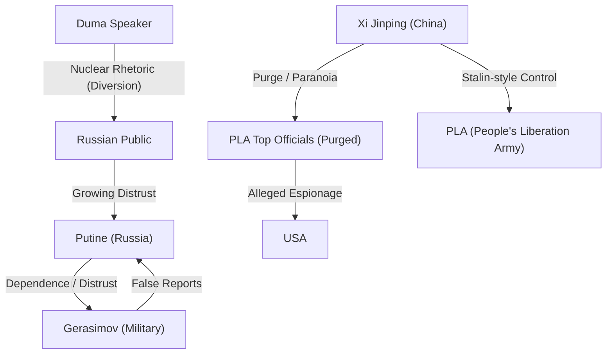

# 📄 YouTube解析スクラップ: ロシア下院衝撃発言！核攻撃を議長が要求／中国軍部の粛清

🗞️ **[Scrap] ロシア下院議長の核使用要求と中国軍高官の相次ぐ粛清**
- **元ソース**: [【ゆっくり解説】ロシア下院衝撃発言！核攻撃を議長が要求…プーチンついに最終判断か。](https://www.youtube.com/watch?v=vleZEMT_m78)
- **チャンネル**: [ゆっくり防衛チャンネル](https://www.youtube.com/@yukkuriboei)
- **投稿日**: 2026-02-05
- **視聴回数**: 20798
- **解析日**: 2026-02-05
- **タグ**: #自衛隊 #ゆっくり #海外の反応 #ロシア #中国 #核兵器 #粛清

## 概要
ロシア下院議長がSNS（Telegram）で「報復兵器（核兵器）」の使用を公然と要求。これは戦況の停滞や国内の不満（プーチン支持層の離反、軍部の虚偽報告への怒り）を外部へ逸らすための「ガス抜き」および印象操作であるとの分析。
一方、中国では人民解放軍の制服組トップ（劉振立氏と推定される文脈）が米側への情報漏洩と汚職疑惑で失脚。習近平国家主席は疑心暗鬼に陥り、軍部への粛清を強化している。内部クーデター未遂の噂もあり、独裁体制の不安定化が指摘される。

## 詳細トピック
- **ロシア下院議長の核発言**:
    - 通常、核への言及は大統領やドクトリンに限られるが、議長がSNSで発信するのは異例。
    - 国内向けのパフォーマンス（強硬姿勢のアピール）の側面が強い。
    - 頻繁な核の脅しは「狼少年」化し、逆にロシアの外交的孤立（晴れ物扱い）と経済制裁の強化を招くリスクがある。
- **ロシア軍部の腐敗**:
    - ゲラシモフ参謀総長らによる戦果の水増し報告（虚偽報告）が横行。
    - 実際には制圧していない地域を「制圧した」と報告し、無謀な突撃命令を正当化している。
    - これにより「プーチンは悪くないが取り巻きが悪い」という従来の支持層の論理が崩れ、プーチンの任命責任や判断能力への批判が高まっている。
- **中国軍部の粛清**:
    - 軍制服組トップレベルの人間が、核機米側への密売（情報漏洩）および巨額の賄賂疑惑で失脚。
    - 習近平主席はこれを「個人的な裏切り」かつ「国家安全保障上の脅威」と捉え、スターリン式の徹底的な粛清（古い世代の排除とイエスマンへの入れ替え）を進めている。
    - 1月18日にはクーデター未遂（習近平拘束計画）があったとの噂もあり、習近平氏は警備を厳重化し、引きこもり状態にあるとされる。

## 🕸️ 勢力・相関図 (ネットワークマップ)


## 📊 マッピング用メタデータ (Mapping Metadata)
※このセクションのJSON構造（キー名）はシステムが読み取るため変更しないでください。

```json
{
  "project_tags": ["Political"],
  "source": {
    "platform": "YouTube",
    "channel": "ゆっくり防衛チャンネル",
    "url": "https://www.youtube.com/watch?v=vleZEMT_m78",
    "source_bias": {
      "anti_ds": 0.0,
      "establishment": 0.5,
      "tone_optimism": 0.1
    }
  },
  "entities": [
    {"name": "Vladimir Putin", "stance": "Weakened Authority", "sentiment": -0.5},
    {"name": "Russian Duma Speaker", "stance": "Aggressive Rhetoric", "sentiment": -0.8},
    {"name": "Valery Gerasimov", "stance": "Corrupt/Incompetent", "sentiment": -0.9},
    {"name": "Xi Jinping", "stance": "Paranoid/Authoritarian", "sentiment": -0.8},
    {"name": "PLA Top Brass", "stance": "Purged/Corrupt", "sentiment": -0.7}
  ]
}
```
