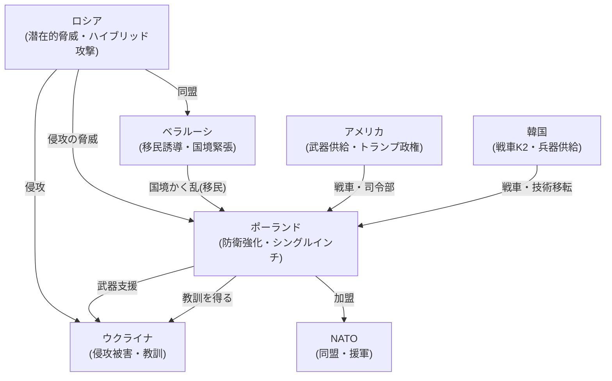

# 📄 YouTube解析スクラップ: 【開戦秒読み⁉】なぜポーランドはロシアと戦争するつもりなのか

🗞️ **[Scrap] ポーランドの国防戦略転換：「戦わずして撤退」から「国境での完全阻止」へ**
- **元ソース**: [YouTube動画](https://www.youtube.com/watch?v=TzVJbL_xNEY)
- **チャンネル**: [ロシア解体新書](https://www.youtube.com/@ロシア解体新書)
- **投稿日**: 2026-02-06
- **視聴回数**: 14206
- **解析日**: 2026-02-06
- **タグ**: #ロシア #ウクライナ #ポーランド #軍事 #NATO

## 概要
ポーランドはかつての「国土の4割を一時放棄する」防衛計画（ウィスワ・プラン）を撤回し、国境ラインで敵を完全に阻止する「シングル・インチ」戦略へと大転換を行った。ロシア・ウクライナ戦争の教訓から、GDP比4.8%という異次元の軍事費を投じ、物理的な壁「シールド・イースト」の建設や韓国・米国からの兵器爆買いを進めている。

## 詳細トピック
- **戦略の大転換**:
  - かつての「ウィスワ・プラン」（初期撤退・援軍待ち）は、ブチャの惨劇等を教訓に「シングル・インチ」（一歩も譲らない）戦略へ変更された。
- **国境の要塞化「シールド・イースト」**:
  - 23億ユーロ以上を投じ、対戦車壕、地雷原、デジタル監視網を備えた防衛ラインを建設中。
  - オタワ条約からの離脱手続きを進め、対人地雷の使用も視野に入れている。
- **欧州最強の陸軍へ**:
  - 2026年の防衛費はGDP比4.8%（約7兆円以上）。
  - 戦車保有数を1,100両へ倍増計画（米エイブラムス、韓K2ブラックパンサー）。
  - 国内での弾薬生産体制の構築や、トランプ政権を見据えた独自の外交戦略も展開。

## 🕸️ 勢力・相関図 (ネットワークマップ)


## 📊 マッピング用メタデータ (Mapping Metadata)
※このセクションのJSON構造（キー名）はシステムが読み取るため変更しないでください。

```json
{
  "source": {
    "platform": "YouTube",
    "channel": "ロシア解体新書",
    "url": "https://www.youtube.com/watch?v=TzVJbL_xNEY",
    "source_bias": {
      "anti_ds": 0.0,
      "establishment": 0.5,
      "tone_optimism": 0.2
    }
  },
  "entities": [
    {"name": "ポーランド", "stance": "徹底抗戦・軍拡", "sentiment": 1.0},
    {"name": "ロシア", "stance": "侵略的脅威", "sentiment": -1.0},
    {"name": "ベラルーシ", "stance": "ロシア追従・ハイブリッド戦", "sentiment": -0.8},
    {"name": "トランプ政権", "stance": "要警戒・取引重視", "sentiment": 0.0}
  ]
}
```
