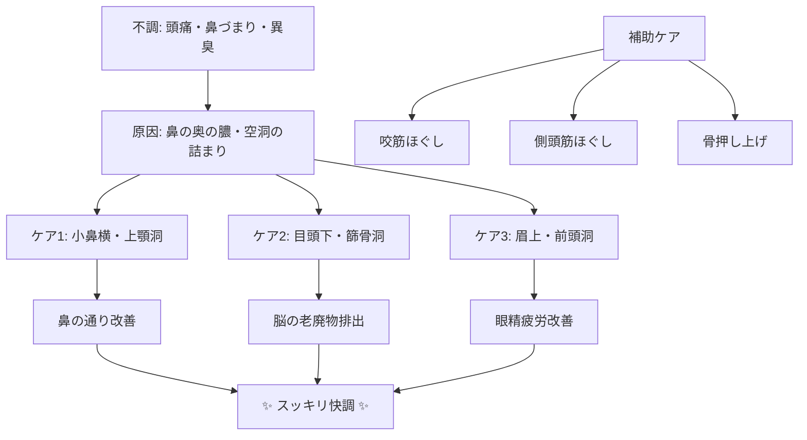

# 📄 YouTube解析スクラップ: 【鼻の奥が腐ってる⁉️】10年溜まった鼻の膿を7日で出す方法

🗞️ **[Scrap] 10年溜まった鼻の膿を7日で出す！副鼻腔炎・頭痛改善セルフケア**
- **元ソース**: [【鼻の奥が腐ってる⁉️】10年溜まった鼻の膿を7日で出す方法｜頭痛・副鼻腔炎](https://www.youtube.com/watch?v=x-m7DmOxxe8)
- **チャンネル**: [めぐわ先生のセルフケア教室](https://www.youtube.com/@めぐわ整体院セルフケア)
- **投稿日**: 2026-01-30
- **視聴回数**: 620,174
- **解析日**: 2026-02-06
- **タグ**: #健康 #副鼻腔炎 #セルフケア #頭痛 #鼻づまり

## 概要
鼻の奥（上顎洞・篩骨洞など）に溜まった「膿」が原因で起こる頭痛、首肩こり、呼吸の浅さを改善するためのセルフケア紹介動画。7日間のプログラムとして構成されているが、即効性のある7つのマッサージ・ストレッチ手技を解説している。

## 詳細トピック
- **症状のセルフチェック**:
    - 鼻呼吸時に異臭（うんちのような臭い）がする。
    - 眉間や頭が重い、首こり、呼吸が浅い。
- **7つのセルフケア手順**:
    1.  **小鼻の横（上顎洞）**: 円を描くようにマッサージ（30秒）。鼻の通りを良くする。
    2.  **目頭の下（篩骨洞/四骨?）**: 円を描くようにマッサージ（30秒）。脳の老廃物を流し頭痛軽減。
    3.  **眉毛の上（前頭洞）**: 2本指で円を描く（30秒）。目の奥の痛み・眼精疲労改善。
    4.  **顎の咬筋**: 奥歯を噛み締めて盛り上がる部分をマッサージ（30秒）。食いしばり改善。
    5.  **側頭筋（耳の上）**: 円を描くように後ろ方向へほぐす（30秒）。頭皮を緩め頭痛改善。
    6.  **頬骨の押し上げ**: 机に肘をつき、頬骨を斜め上へ押し上げながら耳を水平に引っ張る（30秒）。鼻腔拡張。
    7.  **おでこの押し上げ**: 生え際に親指を当て、斜め上へ押す（30秒）。目と鼻の間を広げるイメージ。

## 🕸️ ケア・相関図 (Body Map)


## 📊 マッピング用メタデータ (Mapping Metadata)
※この動画は健康ジャンルのため、政治的スタンス・マッピングからは除外されます。

```json
{
  "project_tags": ["Health", "SelfCare"],
  "source": {
    "platform": "YouTube",
    "channel": "めぐわ先生のセルフケア教室",
    "url": "https://www.youtube.com/watch?v=x-m7DmOxxe8",
    "source_bias": {
      "anti_ds": 0.0,
      "establishment": 0.0,
      "tone_optimism": 1.0
    }
  },
  "entities": [
    {"name": "Upper Jaw Sinus", "stance": "Target of Care", "sentiment": 0.0},
    {"name": "Ethmoid Sinus", "stance": "Target of Care", "sentiment": 0.0}
  ]
}
```
