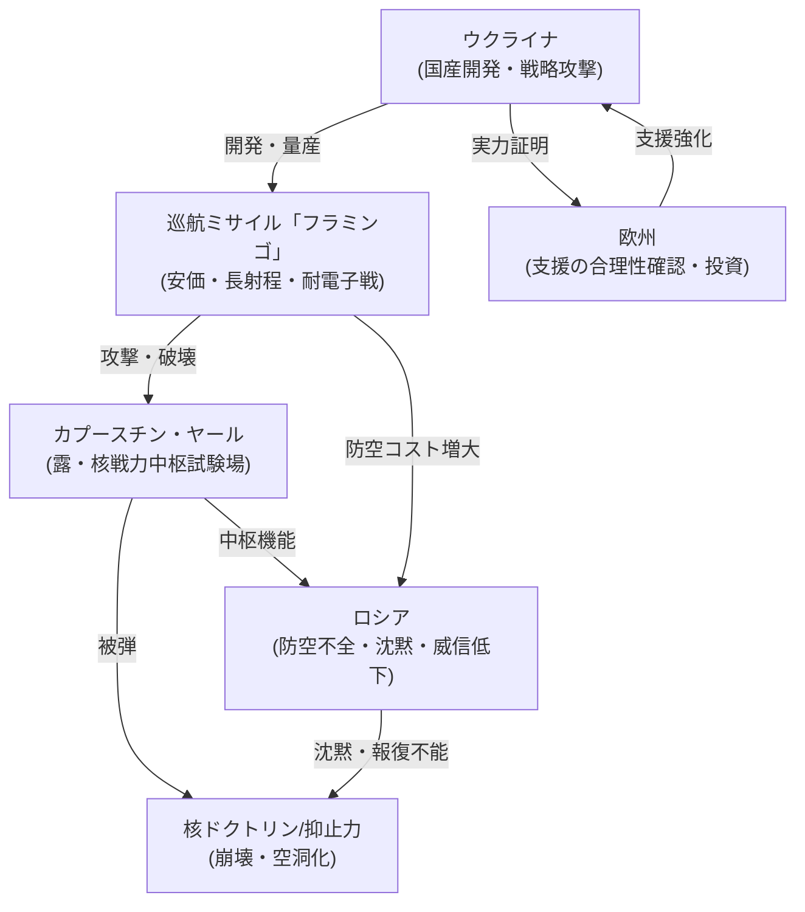

# 📄 YouTube解析スクラップ: さらば核大国ロシア！ウクライナ軍がついに“核試験場”カプースチン・ヤールを撃破...

🗞️ **[Scrap] ウクライナ国産「フラミンゴ」がロシア核中枢を直撃：核ドクトリンの「聖域」崩壊**
- **元ソース**: [YouTube動画](https://www.youtube.com/watch?v=hGZAlRg8S6U)
- **チャンネル**: [BOGDAN in Ukraine](https://www.youtube.com/@BOGDAN_Ukraine)
- **投稿日**: 2026-02-06
- **視聴回数**: 50170
- **解析日**: 2026-02-06
- **タグ**: #ウクライナ #ロシア #フラミンゴ #核ドクトリン #カプースチンヤール

## 概要
ウクライナ軍の新型国産巡航ミサイル「フラミンゴ」が、ロシアの戦略核ミサイル試験場「カプースチン・ヤール」への攻撃に成功した。射程700km〜1000kmに達し、GPS妨害下でも精密打撃が可能。ロシアが「聖域」としてきた核インフラが破壊されたにも関わらずロシア側は沈黙しており、核ドクトリンの実効性と抑止力が崩壊した歴史的転換点と分析されている。

## 詳細トピック
- **カプースチン・ヤール撃破の衝撃**:
  - ICBMや新型ミサイル（オレシュニク等）の試験を行う核戦力の中枢が攻撃され、施設損傷と要員退避が発生。
  - 「核関連施設は攻撃されない」という暗黙の前提（聖域）が物理的に否定された。
- **新型ミサイル「フラミンゴ」の性能**:
  - 推定射程700km〜1000km。黒海西側からの発射でロシア後方深部を打撃可能。
  - 3D地形参照航法により、ロシアが得意な電子戦（GPS妨害）を無効化。
  - 安価で量産可能な設計により、ロシア防空網に「高コストな迎撃」を強いる非対称戦術。
- **ロシアの沈黙と核ドクトリンの崩壊**:
  - ロシアは被害を認めれば威信が傷つき、反応すれば攻撃の実効性を認めることになるため「沈黙」を選択。
  - いわゆる「レッドライン」を超えられても報復できない弱さが露呈し、核恫喝の効力が激減。
- **欧州・国際情勢への影響**:
  - ウクライナへの支援が「慈善」から「有効な安全保障投資」へと認識変化。
  - 欧州はウクライナのミサイル量産支援を強化する合理的根拠を得た。

## 🕸️ 勢力・相関図 (ネットワークマップ)


## 📊 マッピング用メタデータ (Mapping Metadata)
※このセクションのJSON構造（キー名）はシステムが読み取るため変更しないでください。

```json
{
  "source": {
    "platform": "YouTube",
    "channel": "BOGDAN in Ukraine",
    "url": "https://www.youtube.com/watch?v=hGZAlRg8S6U",
    "source_bias": {
      "anti_ds": 0.0,
      "establishment": 0.0,
      "tone_optimism": 0.8
    }
  },
  "entities": [
    {"name": "ウクライナ", "stance": "攻勢・技術革新", "sentiment": 1.0},
    {"name": "ロシア", "stance": "守勢・機能不全", "sentiment": -1.0},
    {"name": "フラミンゴ", "stance": "ゲームチェンジャー", "sentiment": 1.0},
    {"name": "欧州", "stance": "支援継続・再評価", "sentiment": 0.5}
  ]
}
```
