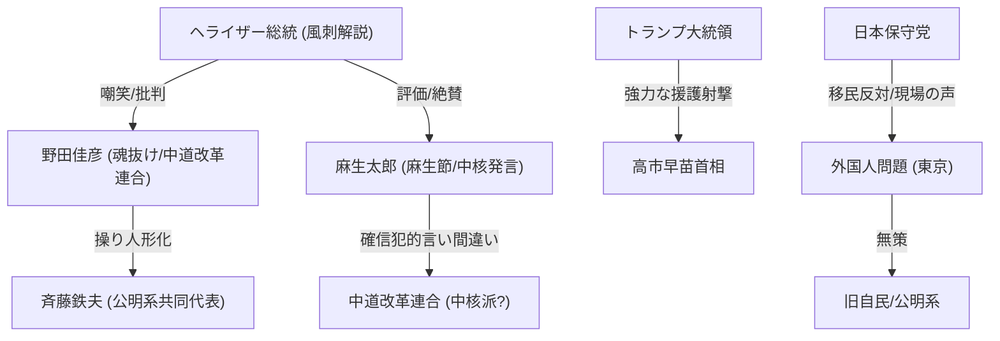

# 📄 YouTube解析スクラップ: 【放送事故】野田佳彦、魂が抜ける…麻生太郎の「中道＝中核」発言がヤバすぎる

🗞️ **[Scrap] 中道改革連合の実態とトランプの内政干渉（ヘライザー総統）**
- **元ソース**: [YouTube動画](https://youtu.be/tUYO_OecJRk?si=6f50dDUngJoCN36_)
- **チャンネル**: [悪の秘密ぼっち「ヘライザー総統」と言う名のファンタジー](https://www.youtube.com/@heraizz)
- **投稿日**: 2026-02-07
- **視聴回数**: 338,684
- **解析日**: 2026-02-08
- **タグ**: #野田佳彦 #中道改革連合 #麻生太郎 #トランプ #高市早苗 #外国人参政権

## 概要
選挙直前の野党「中道改革連合」の迷走ぶりを風刺を交えて徹底批判。
野田佳彦共同代表が斉藤鉄夫代表の隣で「魂が抜けたような表情」をしていること、麻生太郎氏が演説で「中道＝中核（過激派）」と言い間違える（確信犯？）シーンなどを紹介。
さらに、トランプ米大統領が日本の選挙期間中に高市早苗首相への支持を表明し、首脳会談を設定するという異例の「内政干渉」についても取り上げ、これが実質的に高市政権の追い風になっていると分析。

## 詳細トピック
- **野田氏の虚無**: 斉藤代表が「メイクドラマ」と叫ぶ横で、野田氏の目が死んでおり、まるで操り人形のようだと指摘。かつて高市首相に「一泡吹かせる」と意気込んでいた姿は消え失せている。
- **麻生節炸裂**: 麻生太郎氏が演説で中道改革連合を「中核」と言い間違え、会場とネットを沸かせた。「中道とは何の中道なのか？中途半端なだけではないか」とその本質を突く。
- **トランプ砲**: トランプ大統領が高市首相を絶賛し、選挙直後に会談をセット。これは野党へのダメージとなるが、同時に「強いリーダー同士の連携」として市場（日経平均先物）は好感している。
- **移民/外国人受け入れ批判**: 日本保守党（飯山あかり氏ら）の主張を紹介し、移民問題が深刻化する東京の現状と、それに対する自公政権（過去の）や中道改革連合の無策ぶりを対比。

## 🕸️ 勢力・相関図 (ネットワークマップ)


## 📊 マッピング用メタデータ (Mapping Metadata)
※このセクションのJSON構造（キー名）はシステムが読み取るため変更しないでください。

```json
{
  "source": {
    "platform": "YouTube",
    "channel": "悪の秘密ぼっち「ヘライザー総統」と言う名のファンタジー",
    "url": "https://youtu.be/tUYO_OecJRk?si=6f50dDUngJoCN36_",
    "source_bias": {
      "anti_ds": 0.3,
      "establishment": -0.8,
      "tone_optimism": -0.5
    }
  },
  "entities": [
    {"name": "野田佳彦", "stance": "Puppet / Despair", "sentiment": -0.7},
    {"name": "麻生太郎", "stance": "Humorous Critic", "sentiment": 0.8},
    {"name": "中道改革連合", "stance": "Chaotic / Target of Satire", "sentiment": -0.8},
    {"name": "トランプ大統領", "stance": "Strong Ally (Takaichi)", "sentiment": 0.9},
    {"name": "日本保守党", "stance": "Anti-Immigration", "sentiment": 0.7},
    {"name": "斉藤鉄夫", "stance": "Awkward Leader", "sentiment": -0.5}
  ]
}
```
