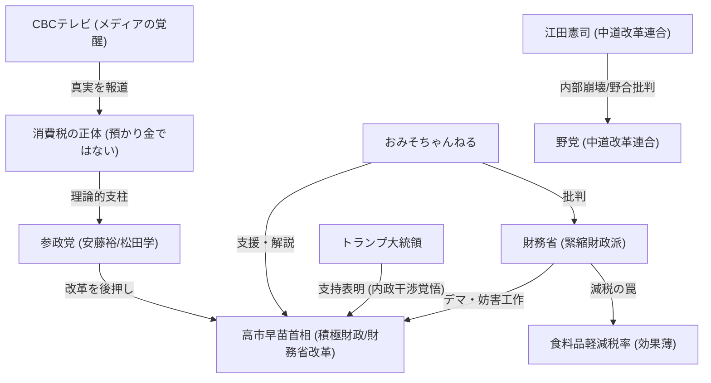

# 📄 YouTube解析スクラップ: 【衆院選】最終日にまさかの事態が発覚！！

🗞️ **[Scrap] 消費税の正体と財務省改革（CBC放送と高市早苗の挑戦）**
- **元ソース**: [YouTube動画](https://youtu.be/_24alxSGm_Q?si=J8db2LvWVGqIphy2)
- **チャンネル**: [おみそちゃんねる【世界どん深闇ニュース】](https://www.youtube.com/@omisochannnel)
- **投稿日**: 2026-02-07
- **視聴回数**: 205,209
- **解析日**: 2026-02-08
- **タグ**: #衆院選 #消費税 #財務省 #高市早苗 #CBC #参政党

## 概要
名古屋のテレビ局CBCが「消費税の正体」という番組を放映し、消費税は預かり金ではなく対価の一部（事業者のコスト）であると解説したことが話題に。
この放送は、財務省支配からの脱却を目指す高市早苗首相や、参政党（安藤裕氏・松田学氏）の主張を後押しする動きと捉えられている。
選挙戦最終日に「消費税12%への増税」というデマが流されたが、これは積極財政派の高市首相を潰そうとする財務省側の工作である可能性が高いと分析されている。

## 詳細トピック
- **CBCの大胆報道**: 「消費税は消費者の納税義務ではなく、価格の一部」という司法判決に基づいた事実を地上波で放送。これは実質的な「財務省タブー」への挑戦。
- **高市政権への攻撃**: 選挙期間中に「消費税12%や食料品減税先送り」などのネガティブキャンペーンが多発。これらは財務省改革（単年度予算から複数年度化への変更など）を進めようとする高市首相への抵抗勢力によるものと推測される。
- **積極財政派の連携**: 参政党（安藤・松田議員）が高市首相の財務省改革を外部から、また党内からは安倍派（積極財政派）が支える構図が重要。食料品だけの減税は財務省の罠（失敗させて緊縮に戻す口実）であるとし、消費税全体の減税・廃止が必要と説く。

## 🕸️ 勢力・相関図 (ネットワークマップ)


## 📊 マッピング用メタデータ (Mapping Metadata)
※このセクションのJSON構造（キー名）はシステムが読み取るため変更しないでください。

```json
{
  "source": {
    "platform": "YouTube",
    "channel": "おみそちゃんねる【世界どん深闇ニュース】",
    "url": "https://youtu.be/_24alxSGm_Q?si=J8db2LvWVGqIphy2",
    "source_bias": {
      "anti_ds": 0.8,
      "establishment": -0.7,
      "tone_optimism": 0.6
    }
  },
  "entities": [
    {"name": "高市早苗", "stance": "Reformer / Target of MOF", "sentiment": 0.9},
    {"name": "財務省", "stance": "Deep State / Saboteur", "sentiment": -0.9},
    {"name": "CBCテレビ", "stance": "Awakened Media", "sentiment": 0.8},
    {"name": "参政党", "stance": "Policy Ally", "sentiment": 0.7},
    {"name": "安藤裕", "stance": "Truth Teller", "sentiment": 0.8},
    {"name": "松田学", "stance": "Truth Teller", "sentiment": 0.8},
    {"name": "トランプ大統領", "stance": "External Supporter", "sentiment": 0.8},
    {"name": "江田憲司", "stance": "Internal Critic (Opposition)", "sentiment": 0.2},
    {"name": "中道改革連合", "stance": "Disorganized Opposition", "sentiment": -0.5}
  ]
}
```
