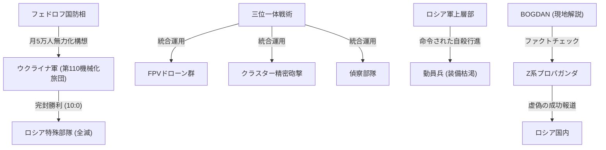

# 📄 YouTube解析スクラップ: 【全滅映像あり】軍事力“世界2位”のロシア軍が歴史的完封負け！

🗞️ **[Scrap] ウクライナ第110旅団 10対0の完全勝利とロシア軍の人海戦術崩壊**
- **元ソース**: [YouTube動画](https://youtu.be/Lrz94SowPQA?si=PBkA4yRfR7fOFKU0)
- **チャンネル**: [BOGDAN in Ukraine](https://www.youtube.com/@BOGDAN_Ukraine)
- **投稿日**: 2026-02-07
- **視聴回数**: 32,455
- **解析日**: 2026-02-08
- **タグ**: #ウクライナ #ロシア軍崩壊 #第110旅団 #FPVドローン #ボグダン

## 概要
2026年初頭、ドネツク戦線でウクライナ軍第110機械化旅団が、ロシア軍の特殊部隊をわずか5分で殲滅（10対0の完全勝利）した衝撃的な映像と詳細分析。
ロシア軍は装甲車不足から「裸の突撃（装甲なしトラック輸送）」を余儀なくされており、死亡率は70%を超えている。
一方ウクライナは、偵察・FPVドローン・クラスター砲撃を完全に同期させた「三位一体戦術」を確立。
フェドロフ新国防相が掲げる「月5万人の削り取り戦略（ロシアの補充能力3.5万人/月を超える損耗）」が現実味を帯びている。

## 詳細トピック
- **三位一体の破壊力**: 偵察ドローンで位置を特定 → FPVドローン群で足止め・打撃 → クラスター砲撃で面制圧。トラックで突撃してきたロシア兵12名中11名が即死、残り1名もその後排除された。
- **ロシア軍の退化**: かつての世界2位の軍事力はなく、現在は「カブリオレ型（天井開放）」の非装甲トラックに兵士を詰め込んで特攻させる状態。正規軍としての機能を喪失し、「命令された自殺行進」となっている。
- **Z系プロパガンダの欺瞞**: ロシア側のブロガーは、この映像の前半（突撃シーン）だけを切り取り「新しい機動戦術の成功」として拡散したが、後半の全滅シーンは隠蔽。ウクライナ軍側はこの情報操作を厳しく批判している。

## 🕸️ 勢力・相関図 (ネットワークマップ)


## 📊 マッピング用メタデータ (Mapping Metadata)
※このセクションのJSON構造（キー名）はシステムが読み取るため変更しないでください。

```json
{
  "source": {
    "platform": "YouTube",
    "channel": "BOGDAN in Ukraine",
    "url": "https://youtu.be/Lrz94SowPQA?si=PBkA4yRfR7fOFKU0",
    "source_bias": {
      "anti_ds": 0.4,
      "establishment": -0.5,
      "tone_optimism": -0.2
    }
  },
  "entities": [
    {"name": "ウクライナ軍", "stance": "Tactical Superiority", "sentiment": 1.0},
    {"name": "ロシア軍", "stance": "Degraded / Suicidal", "sentiment": -1.0},
    {"name": "フェドロフ国防相", "stance": "Strategic Innovator", "sentiment": 0.9},
    {"name": "FPVドローン", "stance": "Game Changer", "sentiment": 0.8},
    {"name": "Z系プロパガンダ", "stance": "Deceptive", "sentiment": -0.8}
  ]
}
```
